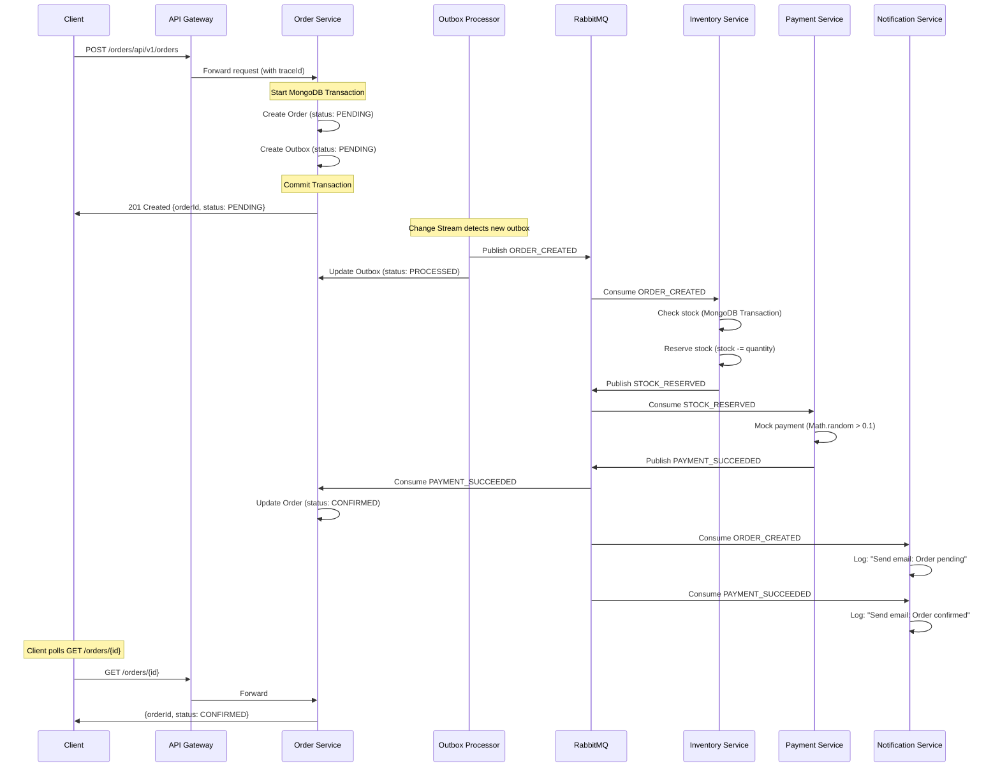
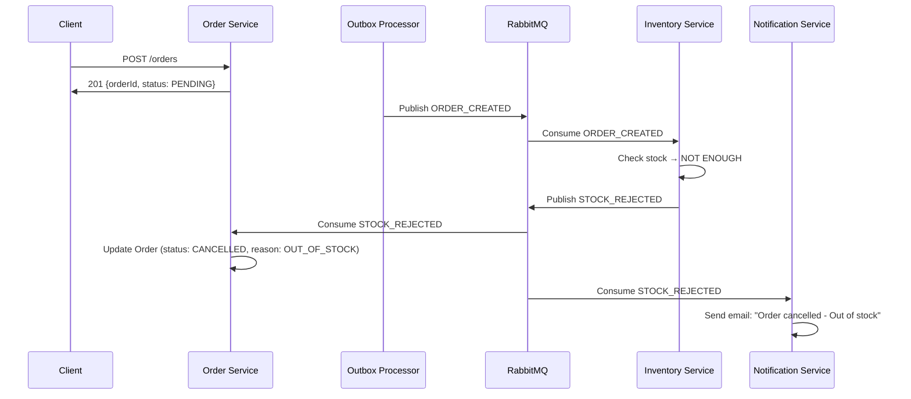
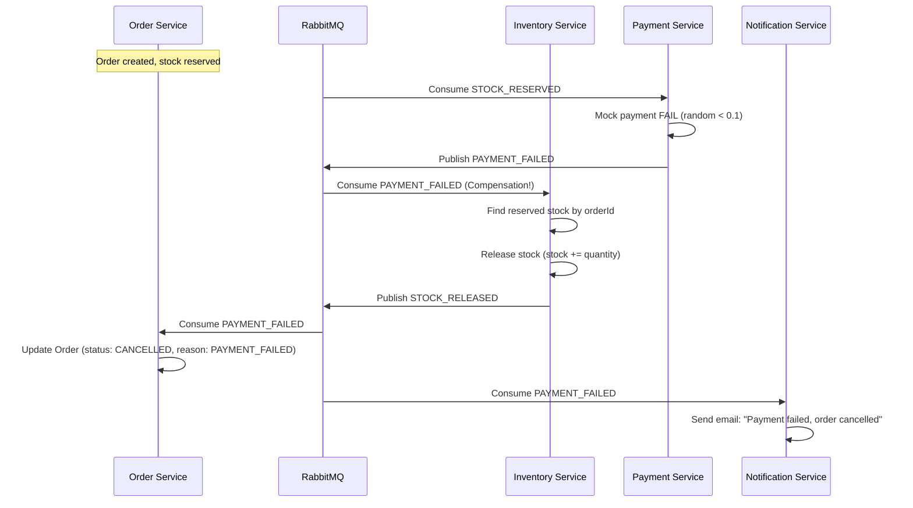
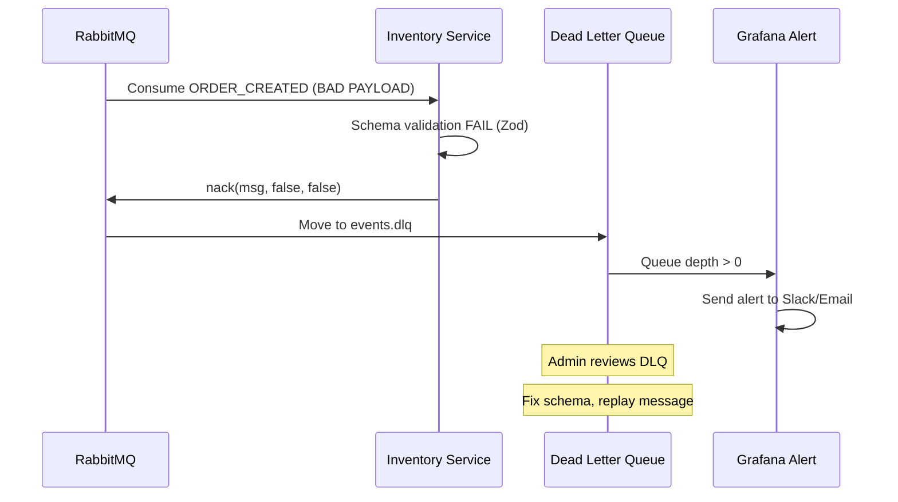

# 🎯 Luồng Saga hoàn chỉnh sau Tuần 6

## 📊 Tổng quan Architecture

Sau khi hoàn thành 6 tuần, hệ thống sẽ có **6 microservices** với **Saga Pattern** hoàn chỉnh:

```
┌─────────────┐
│ API Gateway │ (Port 3003)
└──────┬──────┘
       │
       ├──────────────────────────────────────────────┐
       │                                              │
       ▼                                              ▼
┌─────────────┐                              ┌──────────────┐
│ Auth Service│ (Port 3001)                  │Order Service │ (Port 3002)
│   + JWT     │                              │  + Outbox    │
└─────────────┘                              │  + Change    │
                                             │    Stream    │
                                             └──────┬───────┘
                                                    │
                      ┌─────────────────────────────┼─────────────────────┐
                      │                             │                     │
                      ▼                             ▼                     ▼
              ┌──────────────┐          ┌─────────────────┐    ┌──────────────┐
              │   Product    │          │   Inventory     │    │ Notification │
              │   Service    │          │    Service      │    │   Service    │
              │ (Port 3004)  │          │  (No HTTP API)  │    │(No HTTP API) │
              └──────────────┘          └─────────────────┘    └──────────────┘
                                                   │
                                                   ▼
                                        ┌─────────────────┐
                                        │ Payment Service │
                                        │ (No HTTP API)   │
                                        └─────────────────┘
                               
                      ───────────── RabbitMQ ─────────────
                      
        Infrastructure: Jaeger, Prometheus, Grafana, Redis (Idempotency)
```

---

## 🎪 Danh sách Events (11 events)

### **Core Business Events**
| Event Name | Producer | Consumer(s) | Payload | Purpose |
|------------|----------|-------------|---------|---------|
| `ORDER_CREATED` | Order Service (via Outbox Processor) | Inventory, Notification | `{ orderId, products: [{productId, quantity}], userId, totalPrice }` | Trigger saga, bắt đầu check inventory |
| `STOCK_RESERVED` | Inventory Service | Payment, Order | `{ orderId, productIds, reservedAt, inventoryIds }` | Stock đủ, chuyển sang thanh toán |
| `STOCK_REJECTED` | Inventory Service | Order, Notification | `{ orderId, reason: 'OUT_OF_STOCK', productId }` | Hết hàng, cancel order |
| `PAYMENT_SUCCEEDED` | Payment Service | Order, Notification | `{ orderId, paymentId, amount, paidAt }` | Thanh toán thành công, confirm order |
| `PAYMENT_FAILED` | Payment Service | Inventory (compensation), Order, Notification | `{ orderId, reason, attemptedAt }` | Thanh toán thất bại, rollback inventory |

### **Compensation Events (Rollback)**
| Event Name | Producer | Consumer(s) | Payload | Purpose |
|------------|----------|-------------|---------|---------|
| `STOCK_RELEASED` | Inventory Service | - | `{ orderId, productIds, releasedAt }` | Release stock khi compensation |
| `ORDER_CANCELLED` | Order Service | Notification | `{ orderId, cancellationReason, cancelledAt }` | Thông báo order đã bị hủy |

### **Notification Events** (không trigger logic, chỉ notify)
| Event Name | Purpose |
|------------|---------|
| `ORDER_CONFIRMED_NOTIFICATION` | Email/SMS: "Đơn hàng #{orderId} đã được xác nhận" |
| `ORDER_CANCELLED_NOTIFICATION` | Email/SMS: "Đơn hàng #{orderId} đã bị hủy: {reason}" |

### **Infrastructure Events**
| Event Name | Producer | Consumer(s) | Purpose |
|------------|----------|-------------|---------|
| `OUTBOX_PUBLISHED` | Outbox Processor | - | Log event: Outbox document đã publish thành công |

---

## 🔄 Luồng hoạt động chi tiết

### **Scenario 1: Happy Path (Thành công)**



**Timeline:**
1. **T+0ms:** Client POST order → Response 201 ngay lập tức
2. **T+50ms:** Outbox Processor publish ORDER_CREATED
3. **T+100ms:** Inventory check + reserve stock
4. **T+150ms:** Payment processing
5. **T+200ms:** Order status → CONFIRMED
6. **T+250ms:** Notification sent

**Total E2E Latency:** ~200-300ms (P95 < 500ms theo target Tuần 5)

---

### **Scenario 2: Out of Stock (Compensation)**



---

### **Scenario 3: Payment Failed (Full Compensation)**



**Compensation Logic:**
- Inventory Service **tự động rollback** khi nhận PAYMENT_FAILED
- Idempotent: Nếu nhận PAYMENT_FAILED 2 lần → chỉ release stock 1 lần (check trong Redis)

---

### **Scenario 4: Poison Message (DLQ)**



---

## 📈 Order Status State Machine

```
┌─────────┐
│ PENDING │ (Initial state after POST /orders)
└────┬────┘
     │
     ├─────────────────────────────────┐
     │                                 │
     ▼                                 ▼
┌──────────┐                    ┌──────────────┐
│CONFIRMED │ (Happy Path)       │  CANCELLED   │ (Unhappy Path)
└──────────┘                    └──────────────┘
                                       ▲
                                       │
                    ┌──────────────────┼────────────────┐
                    │                  │                │
              STOCK_REJECTED   PAYMENT_FAILED   TIMEOUT (future)
```

**Allowed Transitions:**
- `PENDING` → `CONFIRMED` (via PAYMENT_SUCCEEDED)
- `PENDING` → `CANCELLED` (via STOCK_REJECTED or PAYMENT_FAILED)
- ❌ `CONFIRMED` → `CANCELLED` (không cho phép - immutable)

---

## 🎯 Features hoàn chỉnh sau Tuần 6

### ✅ **Core Features**
- [x] Transactional Outbox Pattern (at-least-once delivery)
- [x] MongoDB Change Streams (CDC)
- [x] Saga Orchestration (Order → Inventory → Payment → Notification)
- [x] Compensation Logic (rollback when payment fails)
- [x] Idempotency (Redis-based, duplicate events bị skip)
- [x] Schema Validation (Zod, sai schema → DLQ)
- [x] Dead Letter Queue (DLQ) handling

### ✅ **Observability**
- [x] OpenTelemetry distributed tracing (Jaeger)
- [x] Prometheus metrics (saga_started, saga_completed, saga_failed)
- [x] Grafana dashboards (queue depth, latency P95/P99, throughput)
- [x] Correlation ID xuyên suốt tất cả logs

### ✅ **Resilience**
- [x] Retry logic với exponential backoff
- [x] TransientError vs PermanentError classification
- [x] Circuit breaker (via RabbitMQ connection retry)
- [x] Graceful degradation (offline event persist trong Outbox)

### ✅ **Performance**
- [x] Load testing với k6 (50 VUs, 1 phút)
- [x] E2E latency < 500ms (P95)
- [x] Queue depth stable (không backlog)
- [x] Horizontal scalability ready (với Kubernetes)

---

## 📊 Metrics được track (Tuần 5)

| Metric Name | Type | Purpose | Target |
|-------------|------|---------|--------|
| `saga_started_total` | Counter | Số orders được tạo | - |
| `saga_completed_total{status="confirmed"}` | Counter | Số orders thành công | >95% |
| `saga_completed_total{status="cancelled"}` | Counter | Số orders bị hủy | <5% |
| `saga_step_latency_seconds{step="order_to_inventory"}` | Histogram | Latency từ Order → Inventory | P95 < 100ms |
| `saga_step_latency_seconds{step="inventory_to_payment"}` | Histogram | Latency từ Inventory → Payment | P95 < 100ms |
| `saga_e2e_latency_seconds` | Histogram | End-to-end latency | P95 < 500ms |
| `rabbitmq_queue_messages_ready{queue="ORDER_CREATED"}` | Gauge | Queue depth | <50 |
| `outbox_pending_count` | Gauge | Outbox chưa processed | <10 |

---

## 🚨 Alerts được cấu hình (Tuần 5)

| Alert Name | Condition | Severity | Action |
|------------|-----------|----------|--------|
| **HighQueueDepth** | `queue_messages_ready > 100` | Warning | Investigate bottleneck |
| **PoisonMessage** | `dlq_depth > 0` | Critical | Review DLQ, fix schema |
| **HighFailureRate** | `saga_failed / saga_started > 0.05` | Critical | Check Payment/Inventory |
| **OutboxStuck** | `outbox_pending > 1h` | Warning | Check Change Stream |
| **SlowSaga** | `saga_e2e_latency_p95 > 1s` | Warning | Profile services |

---

## 🧪 Test Scenarios (Tuần 6)

### **Load Test với k6**
```javascript
// scenarios.js
export default function() {
  // Scenario 1: Happy path (90%)
  if (Math.random() < 0.9) {
    const orderId = createOrder();
    pollOrderStatus(orderId, 'CONFIRMED');
  }
  
  // Scenario 2: Out of stock (5%)
  else if (Math.random() < 0.95) {
    const orderId = createOrderOutOfStock();
    pollOrderStatus(orderId, 'CANCELLED');
  }
  
  // Scenario 3: Payment failed (5%)
  else {
    const orderId = createOrderPaymentFail();
    pollOrderStatus(orderId, 'CANCELLED');
  }
}
```

**Load Test Results (Expected):**
- 50 VUs × 60s = ~3000 requests
- Success rate: >95%
- P95 latency: <500ms
- P99 latency: <1s
- Queue depth: stable <50

---

## 📦 Deliverables sau Tuần 6

### **Services (6)**
1. ✅ API Gateway (port 3003)
2. ✅ Auth Service (port 3001)
3. ✅ Order Service (port 3002) - với Outbox + Change Stream
4. ✅ Product Service (port 3004)
5. ✅ Inventory Service (no HTTP API) - consumer only
6. ✅ Payment Service (no HTTP API) - consumer only
7. ✅ Notification Service (no HTTP API) - consumer only

### **Shared Packages (4)**
1. ✅ @ecommerce/broker - với idempotency, schema validation, tracing
2. ✅ @ecommerce/logger - auto-inject traceId
3. ✅ @ecommerce/config - Zod validation
4. ✅ @ecommerce/tracing - OpenTelemetry setup

### **Infrastructure**
1. ✅ RabbitMQ (with management UI)
2. ✅ MongoDB Replica Set (for transactions)
3. ✅ Redis (for idempotency)
4. ✅ Jaeger (distributed tracing)
5. ✅ Prometheus (metrics collection)
6. ✅ Grafana (dashboards + alerts)

### **Documentation**
1. ✅ README.md với Saga flow diagram (Mermaid.js)
2. ✅ Debugging Guide (DLQ inspection, replay events)
3. ✅ Scaling Notes (Kubernetes, Change Stream considerations)
4. ✅ API documentation (OpenAPI/Swagger)

---

## 🎓 Key Learnings

### **Saga Pattern Benefits:**
- ✅ **Eventual Consistency** thay vì distributed transactions
- ✅ **Resilience:** Mỗi service có thể fail độc lập, không ảnh hưởng toàn bộ
- ✅ **Scalability:** Services scale independently
- ✅ **Observability:** Trace toàn bộ flow qua Jaeger

### **Transactional Outbox Benefits:**
- ✅ **At-least-once delivery:** Event không bao giờ bị mất
- ✅ **Atomicity:** Order + Event được tạo cùng lúc
- ✅ **Decoupling:** Write DB và publish RabbitMQ tách biệt

### **Trade-offs:**
- ⚠️ **Complexity tăng:** 6 services vs 1 monolith
- ⚠️ **Eventual consistency:** Order status không instant
- ⚠️ **Debugging khó hơn:** Cần distributed tracing
- ⚠️ **Operational overhead:** Nhiều infrastructure components

---

## 🚀 Next Steps (Beyond Week 6)

### **Phase 3: Advanced Features**
- [ ] Saga timeout handling (nếu Payment không response sau 30s → auto-cancel)
- [ ] Partial compensation (rollback một phần chain)
- [ ] Event versioning (schema evolution)
- [ ] CQRS pattern (read model vs write model)
- [ ] Event Sourcing (store events, rebuild state)

### **Phase 4: Production Ready**
- [ ] Kubernetes deployment (Helm charts)
- [ ] Horizontal pod autoscaling (HPA)
- [ ] Service mesh (Istio) for advanced routing
- [ ] Multi-region deployment
- [ ] Disaster recovery plan

---

## 📞 Contact & Support

- Slack channel: #saga-pattern-support
- On-call rotation: PagerDuty
- Runbook: `docs/runbooks/saga-troubleshooting.md`
