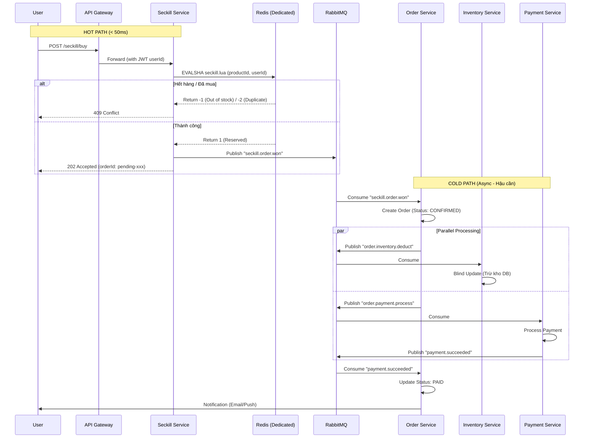
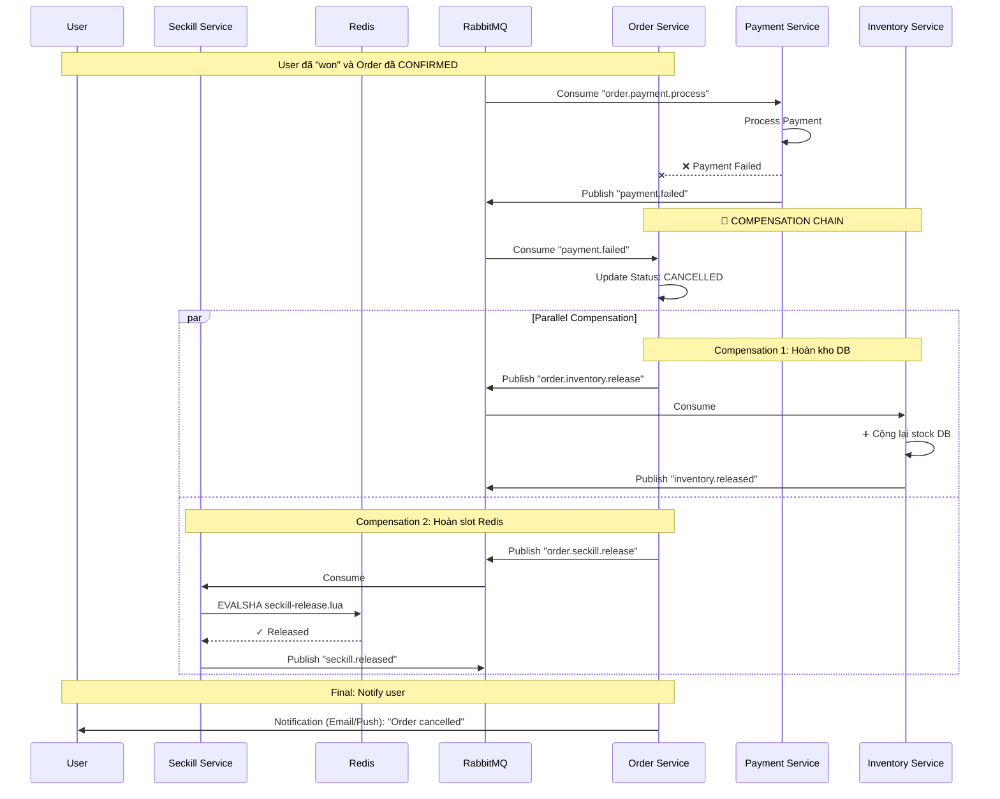
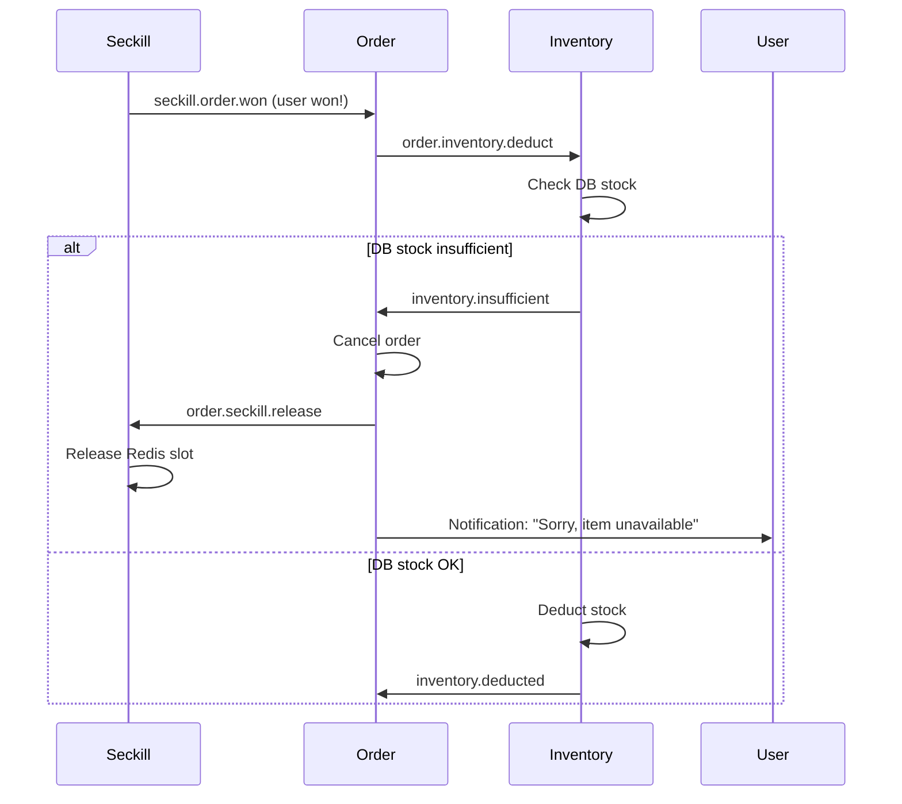

# ⚡ Seckill Service (High-Performance Flash Sale Engine)

## 1. Tổng quan (Overview)

**Seckill Service** là một Microservice chuyên biệt cho Flash Sale, đóng vai trò là **Hot Path** (đường nóng) xử lý hàng triệu request trong thời gian cực ngắn, tách biệt hoàn toàn khỏi luồng Order thông thường.

* **Vị trí:** Nằm ngay sau API Gateway, có Redis riêng biệt (dedicated).
* **Triết lý:** **"Win first, process later"** - Người dùng giành được slot trước, hệ thống xử lý sau.
* **Nhiệm vụ cốt lõi:** 
  - Atomic stock check & reservation trên Redis (Lua Script)
  - Publish event `seckill.order.won` cho Order Service xử lý
  - **KHÔNG** kết nối Database trong hot path

## 2. Nguyên tắc thiết kế (Design Principles)

1. **No-Database in Hot Path:** Service này **TUYỆT ĐỐI KHÔNG** kết nối Database trong luồng mua hàng. Mọi thao tác đều trên Redis.
2. **Fail Fast:** Hết hàng hoặc đã mua → Trả lỗi ngay lập tức (< 10ms). Không retry, không queue.
3. **Atomic Operations:** Sử dụng **Redis Lua Script** để đảm bảo check + reserve là một transaction duy nhất.
4. **Fire-and-Forget:** Sau khi reserve thành công, publish event `seckill.order.won` và trả về `202 Accepted` ngay. Order Service xử lý phần còn lại.
5. **Eventual Consistency:** Order có thể fail sau khi user "won" (payment failed, inventory sync failed) → Cần compensation logic ở Order Service.

## 3. Kiến trúc Luồng dữ liệu (Data Flow)

### 3.1. Happy Path (Thành công)



### 3.2. Unhappy Path (Compensation - Payment Failed)



## 4. Cấu trúc Project (Folder Structure)

```text
services/seckill/
├── src/
│   ├── config/
│   │   ├── redis.js              # Redis client + Lua script loader
│   │   └── config.js             # Env validation (Zod)
│   ├── scripts/
│   │   ├── seckill-reserve.lua   # 📜 Core: Atomic reserve
│   │   └── seckill-release.lua   # Compensation: Release slot
│   ├── controllers/
│   │   ├── seckillController.js  # POST /buy, GET /status
│   │   └── adminController.js    # POST /admin/init, /admin/release
│   ├── services/
│   │   └── seckillService.js     # Business logic
│   ├── routes/
│   │   ├── seckillRoutes.js
│   │   └── adminRoutes.js
│   ├── middlewares/
│   │   └── authMiddleware.js     # JWT verification (reuse from auth)
│   ├── metrics.js                # Prometheus metrics
│   └── app.js
├── Dockerfile
├── package.json
└── .env.example
```

## 5. Chi tiết API & Logic

### 5.1. Admin API: Nạp đạn (Pre-warm)

**Endpoint:** `POST /admin/seckill/init`

**Headers:** `X-Admin-Key: <secret>` (từ env var, không dùng JWT)

**Body:**
```json
{
  "productId": "iphone_15_promax",
  "stock": 1000,
  "price": 999.99,
  "startTime": "2025-12-12T00:00:00Z",
  "endTime": "2025-12-12T01:00:00Z"
}
```

**Logic:**
```javascript
// 1. Validate input (Zod schema)
// 2. Load data to Redis
await redis.set(`seckill:${productId}:stock`, stock);
await redis.set(`seckill:${productId}:price`, price);
await redis.set(`seckill:${productId}:start`, startTime);
await redis.set(`seckill:${productId}:end`, endTime);
await redis.del(`seckill:${productId}:users`); // Clear old winners

// 3. Return success
return { success: true, productId, stock };
```

---

### 5.2. Public API: Săn hàng (Flash Buy)

**Endpoint:** `POST /seckill/buy`

**Headers:** `Authorization: Bearer <token>` (JWT từ Auth Service)

**Body:**
```json
{
  "productId": "iphone_15_promax"
}
```

**Logic (Node.js):**
```javascript
// 1. Extract userId from JWT (middleware đã verify)
const userId = req.user.id;

// 2. Execute Lua script (atomic)
const result = await redis.evalSha(
  seckillReserveSHA, // Pre-loaded SHA
  2, // Number of keys
  `seckill:${productId}:stock`,
  `seckill:${productId}:users`,
  userId
);

// 3. Handle result
if (result === -1) {
  return res.status(409).json({ error: 'OUT_OF_STOCK' });
}
if (result === -2) {
  return res.status(409).json({ error: 'ALREADY_PURCHASED' });
}
if (result === -3) {
  return res.status(400).json({ error: 'CAMPAIGN_NOT_STARTED' });
}

// 4. Success: Publish event
const eventId = uuidv4();
const correlationId = req.traceId; // From OpenTelemetry context

await broker.publish('seckill.order.won', {
  userId,
  productId,
  price: await redis.get(`seckill:${productId}:price`),
  quantity: 1,
  timestamp: Date.now()
}, { eventId, correlationId });

// 5. Return immediately
return res.status(202).json({
  success: true,
  orderId: `pending-${eventId}`,
  message: 'Order is being processed'
});
```

---

### 5.3. Query API: Kiểm tra trạng thái

**Endpoint:** `GET /seckill/status/:productId`

**Response:**
```json
{
  "productId": "iphone_15_promax",
  "stockRemaining": 234,
  "totalStock": 1000,
  "isActive": true,
  "startTime": "2025-12-12T00:00:00Z",
  "endTime": "2025-12-12T01:00:00Z"
}
```

---

### 5.4. Admin API: Giải phóng slot (Compensation)

**Endpoint:** `POST /admin/seckill/release`

**Body:**
```json
{
  "productId": "iphone_15_promax",
  "userId": "user_123"
}
```

**Logic:** Gọi Lua script `seckill-release.lua` để:
- `SREM seckill:{productId}:users {userId}`
- `INCR seckill:{productId}:stock`

## 6. "Vũ khí bí mật": Lua Scripts

### 6.1. `seckill-reserve.lua` (Core Logic)

Đây là đoạn code quan trọng nhất, quyết định sự sống còn của service.

```lua
-- KEYS[1]: seckill:{productId}:stock
-- KEYS[2]: seckill:{productId}:users
-- ARGV[1]: userId

-- 1. Chặn mua trùng (Idempotency)
if redis.call("SISMEMBER", KEYS[2], ARGV[1]) == 1 then
    return -2 -- User đã mua rồi
end

-- 2. Kiểm tra tồn kho
local stock = tonumber(redis.call("GET", KEYS[1]))
if stock == nil then 
    return -3 -- Campaign chưa init
end
if stock <= 0 then 
    return -1 -- Hết hàng
end

-- 3. Atomic reserve (Thực hiện cùng lúc)
redis.call("DECR", KEYS[1])          -- Trừ tồn kho
redis.call("SADD", KEYS[2], ARGV[1]) -- Ghi userId vào set

return 1 -- Thành công
```

### 6.2. `seckill-release.lua` (Compensation)

Dùng khi Order Service cần hoàn lại slot (payment failed, etc.)

```lua
-- KEYS[1]: seckill:{productId}:stock
-- KEYS[2]: seckill:{productId}:users
-- ARGV[1]: userId

-- 1. Kiểm tra user có trong danh sách không
if redis.call("SISMEMBER", KEYS[2], ARGV[1]) == 0 then
    return -1 -- User không có trong danh sách (idempotent)
end

-- 2. Atomic release
redis.call("SREM", KEYS[2], ARGV[1]) -- Xóa userId
redis.call("INCR", KEYS[1])          -- Cộng lại stock

return 1 -- Thành công
```

## 7. Message Payload & Event Schema

### 7.1. Event: `seckill.order.won`

**Routing Key:** `seckill.order.won`

**Payload (Zod Schema):**
```javascript
const SeckillOrderWonSchema = z.object({
  userId: z.string().uuid(),
  productId: z.string(),
  price: z.number().positive(),
  quantity: z.number().int().positive().default(1),
  timestamp: z.number().int(),
  metadata: z.object({
    campaignId: z.string().optional(),
    source: z.literal('seckill')
  })
});
```

**Example:**
```json
{
  "userId": "550e8400-e29b-41d4-a716-446655440000",
  "productId": "iphone_15_promax",
  "price": 999.99,
  "quantity": 1,
  "timestamp": 1733443200000,
  "metadata": {
    "campaignId": "flash-sale-2025-12",
    "source": "seckill"
  }
}
```

**Message Properties:**
- `messageId`: eventId (UUID v4)
- `correlationId`: traceId (from OpenTelemetry)
- `headers`: `{ 'x-routing-key': 'seckill.order.won', 'traceparent': '...' }`

---

### 7.2. Event: `order.inventory.deduct` (Order → Inventory)

**Routing Key:** `order.inventory.deduct`

**Payload:**
```json
{
  "orderId": "67890",
  "productId": "iphone_15_promax",
  "quantity": 1,
  "operation": "BLIND_DEDUCT"
}
```

**Note:** Inventory Service sẽ trừ kho DB mà **không check** (vì Seckill đã check trên Redis).

---

### 7.3. Event: `order.payment.process` (Order → Payment)

**Routing Key:** `order.payment.process`

**Payload:**
```json
{
  "orderId": "67890",
  "userId": "user_123",
  "amount": 999.99,
  "currency": "USD"
}
```

---

### 7.4. Event: `payment.failed` (Payment → Order)

**Routing Key:** `payment.failed`

**Payload:**
```json
{
  "orderId": "67890",
  "userId": "user_123",
  "amount": 999.99,
  "reason": "INSUFFICIENT_FUNDS",
  "timestamp": 1733443300000
}
```

---

### 7.5. Event: `order.inventory.release` (Compensation)

**Routing Key:** `order.inventory.release`

**Payload:**
```json
{
  "orderId": "67890",
  "productId": "iphone_15_promax",
  "quantity": 1,
  "reason": "PAYMENT_FAILED"
}
```

**Handler (Inventory Service):**
```javascript
// Inventory Service consumer for compensation
broker.consume('q.inventory.release', async (data, metadata) => {
  const { orderId, productId, quantity } = data;
  
  // Cộng lại stock DB (idempotent với eventId)
  const result = await Inventory.findOneAndUpdate(
    { productId },
    { $inc: { stock: quantity } },
    { new: true }
  );
  
  if (!result) {
    logger.error({ orderId, productId }, '❌ Product not found in inventory');
    throw new Error('Product not found');
  }
  
  logger.info({ 
    orderId, 
    productId, 
    quantity, 
    newStock: result.stock 
  }, '✓ Inventory released (compensation)');
  
  // Publish confirmation event
  await broker.publish('inventory.released', {
    orderId,
    productId,
    quantity,
    currentStock: result.stock
  }, { eventId: metadata.eventId, correlationId: metadata.correlationId });
}, InventoryReleaseSchema, ['order.inventory.release']);
```

---

### 7.6. Event: `order.seckill.release` (Compensation)

**Routing Key:** `order.seckill.release`

**Payload:**
```json
{
  "orderId": "67890",
  "userId": "user_123",
  "productId": "iphone_15_promax",
  "reason": "PAYMENT_FAILED"
}
```

**Handler (Seckill Service):**
```javascript
// Seckill Service consumer
broker.consume('q.seckill.release', async (data, metadata) => {
  const { userId, productId, orderId } = data;
  
  // Execute Lua script to release slot
  const result = await redis.evalSha(
    seckillReleaseSHA,
    2,
    `seckill:${productId}:stock`,
    `seckill:${productId}:users`,
    userId
  );
  
  if (result === 1) {
    logger.info({ orderId, userId, productId }, '✓ Seckill slot released');
    
    // Publish confirmation event
    await broker.publish('seckill.released', {
      orderId,
      userId,
      productId
    }, { eventId: metadata.eventId, correlationId: metadata.correlationId });
  } else {
    logger.warn({ orderId, userId, productId }, '⚠️ Slot already released (idempotent)');
  }
}, SeckillReleaseSchema, ['order.seckill.release']);
```

---

### 7.7. Event: `inventory.released` (Confirmation)

**Routing Key:** `inventory.released`

**Payload:**
```json
{
  "orderId": "67890",
  "productId": "iphone_15_promax",
  "quantity": 1
}
```

---

### 7.8. Event: `seckill.released` (Confirmation)

**Routing Key:** `seckill.released`

**Payload:**
```json
{
  "orderId": "67890",
  "userId": "user_123",
  "productId": "iphone_15_promax"
}
```

### 8\. Yêu cầu tài nguyên (Resource Requirements)

  * **RAM:** Cần nhiều (để lưu danh sách `seckill:users` - danh sách hàng triệu người mua).
  * **CPU:** Cần cao (để Node.js serialize JSON và Redis chạy Lua).
  * **Deployment:** Khuyến nghị chạy tối thiểu 2-3 Replicas trên **VM 2** để đảm bảo High Availability.


## 8. Tích hợp với Project hiện tại

### 8.1. Dependencies (package.json)

```json
{
  "name": "@ecommerce/seckill",
  "version": "1.0.0",
  "dependencies": {
    "@ecommerce/config": "workspace:*",
    "@ecommerce/logger": "workspace:*",
    "@ecommerce/message-broker": "workspace:*",
    "@ecommerce/metrics": "workspace:*",
    "@ecommerce/tracing": "workspace:*",
    "express": "^4.18.2",
    "redis": "^4.6.12",
    "uuid": "^9.0.0",
    "zod": "^3.22.4",
    "jsonwebtoken": "^9.0.0"
  }
}
```

### 8.2. Environment Variables (.env)

```bash
# Seckill Service
SECKILL_PORT=3007
SECKILL_REDIS_URL=redis://redis-seckill:6379
RABBITMQ_URL=amqp://rabbitmq:5672
EXCHANGE_NAME=ecommerce.events
JWT_SECRET=<same-as-auth>
JAEGER_ENDPOINT=http://jaeger:4318/v1/traces

# Admin API Security
SECKILL_ADMIN_KEY=<random-secret-key>
```

### 8.3. Docker Compose (thêm vào docker-compose.yml)

```yaml
services:
  # Seckill Service
  seckill:
    build:
      context: .
      dockerfile: ./services/seckill/Dockerfile
    ports:
      - "${SECKILL_PORT:-3007}:3007"
    environment:
      - NODE_ENV=${NODE_ENV:-development}
      - PORT=${SECKILL_PORT:-3007}
      - REDIS_URL=${SECKILL_REDIS_URL:-redis://redis-seckill:6379}
      - RABBITMQ_URL=${RABBITMQ_URL:-amqp://rabbitmq:5672}
      - EXCHANGE_NAME=${EXCHANGE_NAME:-ecommerce.events}
      - JWT_SECRET=${JWT_SECRET}
      - JAEGER_ENDPOINT=${JAEGER_ENDPOINT:-http://jaeger:4318/v1/traces}
      - SECKILL_ADMIN_KEY=${SECKILL_ADMIN_KEY}
    depends_on:
      - redis-seckill
      - rabbitmq
      - jaeger
    networks:
      - ecommerce-network

  # Dedicated Redis for Seckill (High Performance)
  redis-seckill:
    image: redis:7-alpine
    container_name: 'redis-seckill'
    ports:
      - "6380:6379"
    networks:
      - ecommerce-network
    volumes:
      - redis_seckill_data:/data
    command: redis-server --appendonly yes --maxmemory 2gb --maxmemory-policy noeviction
    healthcheck:
      test: ["CMD", "redis-cli", "ping"]
      interval: 10s
      timeout: 3s
      retries: 5

volumes:
  redis_seckill_data:
```

### 8.4. API Gateway Routing (thêm vào api-gateway)

```javascript
// services/api-gateway/index.js
const routes = [
  // ... existing routes
  {
    path: '/seckill',
    target: process.env.SECKILL_SERVICE_URL || 'http://seckill:3007'
  }
];
```

---

## 9. Implementation Checklist

### Phase 1: Core Setup (Tuần 1)
- [ ] Tạo service structure `services/seckill/`
- [ ] Setup Redis client với Lua script loader
- [ ] Implement `seckill-reserve.lua` và `seckill-release.lua`
- [ ] Tích hợp `@ecommerce/logger` với OpenTelemetry
- [ ] Tích hợp `@ecommerce/message-broker`
- [ ] Implement Admin API: `POST /admin/init`
- [ ] Implement Public API: `POST /buy`
- [ ] Implement Query API: `GET /status/:productId`
- [ ] Thêm vào docker-compose.yml
- [ ] Test cơ bản: Init → Buy → Check status

### Phase 2: Order Service Integration (Tuần 2)
- [ ] Order Service: Consumer cho `seckill.order.won`
  - [ ] Tạo Order với status `CONFIRMED` (skip PENDING)
  - [ ] Lưu metadata: `{ source: 'seckill', seckillReserved: true }`
  - [ ] Publish `order.inventory.deduct` (parallel)
  - [ ] Publish `order.payment.process` (parallel)
- [ ] Inventory Service: Consumer cho `order.inventory.deduct`
  - [ ] Check stock > 0 trước khi trừ (safety check)
  - [ ] Trừ stock DB với atomic operation
  - [ ] Nếu stock < 0 sau khi trừ → Publish `inventory.insufficient`
  - [ ] Log với correlationId
- [ ] Payment Service: Consumer cho `order.payment.process`
  - [ ] Mock payment logic (90% success, 10% fail)
  - [ ] Publish `payment.succeeded` hoặc `payment.failed`
- [ ] Test E2E: Seckill → Order → Inventory + Payment

### Phase 3: Compensation Logic (Tuần 3)
- [ ] Payment Service: Publish `payment.failed` khi payment thất bại
- [ ] Order Service: Consumer cho `payment.failed`
  - [ ] Update Order status → `CANCELLED`
  - [ ] Publish `order.inventory.release` (parallel)
  - [ ] Publish `order.seckill.release` (parallel)
- [ ] Inventory Service: Consumer cho `order.inventory.release`
  - [ ] Cộng lại stock DB
  - [ ] Publish `inventory.released` (confirmation)
- [ ] Seckill Service: Consumer cho `order.seckill.release`
  - [ ] Execute `seckill-release.lua` để xóa userId và cộng stock Redis
  - [ ] Publish `seckill.released` (confirmation)
- [ ] Order Service: Consumer cho `inventory.released` và `seckill.released`
  - [ ] Log compensation completed
  - [ ] Trigger notification service
- [ ] Test compensation: Force payment fail → Verify:
  - [ ] Order status = CANCELLED
  - [ ] Inventory stock increased
  - [ ] Redis stock increased
  - [ ] Redis set không còn userId

### Phase 4: Observability (Tuần 4)
- [ ] Prometheus metrics:
  - `seckill_requests_total{status="success|failed"}`
  - `seckill_reserve_latency_seconds` (histogram)
  - `seckill_stock_remaining{productId}`
- [ ] Grafana dashboard cho Seckill metrics
- [ ] Alert: `seckill_stock_remaining == 0`
- [ ] Alert: `seckill_reserve_latency_seconds > 0.05` (P99)

### Phase 5: Load Testing (Tuần 5)
- [ ] k6 script: Simulate 10,000 concurrent users
- [ ] Test scenario: 1000 stock, 10,000 requests
- [ ] Verify: Exactly 1000 orders created (no oversell)
- [ ] Verify: No duplicate userId in Redis set
- [ ] Performance target: P99 < 50ms

---

## 10. Yêu cầu tài nguyên (Resource Requirements)

### Redis (Dedicated)
- **RAM:** 2GB (cho 1 triệu users trong set)
- **CPU:** 2 cores
- **Persistence:** Không cần (ephemeral data)
- **Config:** `maxmemory-policy allkeys-lru`

### Seckill Service
- **RAM:** 512MB per instance
- **CPU:** 2 cores per instance
- **Replicas:** 3-5 instances (horizontal scaling)
- **Load Balancer:** Nginx/HAProxy trước Gateway

### Network
- **Latency:** Seckill ↔ Redis < 1ms (same host/network)
- **Bandwidth:** 100 Mbps minimum

---

## 11. Rủi ro & Giải pháp (Risks & Mitigations)

| Rủi ro | Tác động | Giải pháp |
|--------|----------|-----------|
| **Redis down** | Toàn bộ Seckill fail | Redis Sentinel (HA) hoặc Redis Cluster |
| **Oversell** | Bán quá số lượng | Lua script atomic + Unit test coverage 100% |
| **User won nhưng Order fail** | User complain | Compensation logic + Retry mechanism |
| **DDoS attack** | Service overload | Rate limiting ở Gateway (per IP/user) |
| **Redis memory full** | Service crash | `maxmemory-policy` + Monitor memory usage |
| **Lua script bug** | Data corruption | Canary deployment + Rollback plan |

---

## 12. Testing Strategy

### Unit Tests
- Lua script logic (mock Redis)
- Controller input validation
- Service layer business logic

### Integration Tests
- Redis connection + Lua script execution
- RabbitMQ publish/consume
- JWT authentication

### E2E Tests
- Full flow: Init → Buy → Order → Payment
- Compensation flow: Payment fail → Release stock
- Idempotency: Duplicate requests

### Load Tests (k6)
```javascript
// k6-seckill.js
import http from 'k6/http';
import { check } from 'k6';

export let options = {
  stages: [
    { duration: '10s', target: 1000 },  // Ramp up
    { duration: '30s', target: 10000 }, // Peak load
    { duration: '10s', target: 0 },     // Ramp down
  ],
};

export default function () {
  const res = http.post('http://localhost:3003/seckill/buy', 
    JSON.stringify({ productId: 'iphone_15_promax' }),
    { headers: { 
      'Content-Type': 'application/json',
      'Authorization': `Bearer ${__ENV.TEST_TOKEN}`
    }}
  );
  
  check(res, {
    'status is 202 or 409': (r) => r.status === 202 || r.status === 409,
    'latency < 100ms': (r) => r.timings.duration < 100,
  });
}
```

---

## 13. Monitoring & Alerts

### Key Metrics
1. **Throughput:** `seckill_requests_total` (requests/sec)
2. **Latency:** `seckill_reserve_latency_seconds` (P50, P95, P99)
3. **Success Rate:** `seckill_success_total / seckill_requests_total`
4. **Stock Remaining:** `seckill_stock_remaining{productId}`
5. **Redis Memory:** `redis_memory_used_bytes`

### Critical Alerts
```yaml
# Prometheus Alert Rules
groups:
  - name: seckill
    rules:
      - alert: SeckillHighLatency
        expr: histogram_quantile(0.99, seckill_reserve_latency_seconds) > 0.05
        for: 1m
        annotations:
          summary: "Seckill P99 latency > 50ms"
      
      - alert: SeckillStockDepleted
        expr: seckill_stock_remaining == 0
        annotations:
          summary: "Product {{ $labels.productId }} sold out"
      
      - alert: SeckillRedisDown
        expr: up{job="redis-seckill"} == 0
        for: 30s
        annotations:
          summary: "Seckill Redis is down!"
```

---

## 14. Deployment Strategy

### Pre-Launch (1 giờ trước Flash Sale)
1. Deploy Seckill service (3 replicas)
2. Warm up Redis: `POST /admin/init` với stock data
3. Verify health checks: `GET /status/:productId`
4. Load test với 10% traffic

### During Flash Sale
1. Monitor Grafana dashboard real-time
2. Auto-scaling nếu CPU > 70%
3. Standby engineer on-call

### Post-Launch (Sau Flash Sale)
1. Export metrics cho analysis
2. Review logs cho errors/anomalies
3. Cleanup Redis data (optional)
4. Post-mortem meeting

---

## 15. Future Enhancements

### Phase 2 (Sau MVP)
- [ ] **Captcha/Bot Detection:** Chặn bot tự động
- [ ] **Queue System:** Hàng đợi ảo (virtual queue) khi quá tải
- [ ] **Pre-order:** Cho phép đặt trước trước giờ G
- [ ] **Multi-tier Pricing:** Giá thay đổi theo thời gian
- [ ] **Geo-based Routing:** Route user đến Redis gần nhất

### Phase 3 (Advanced)
- [ ] **Redis Cluster:** Sharding theo productId
- [ ] **CQRS:** Tách read/write models
- [ ] **Event Sourcing:** Lưu toàn bộ events cho audit
- [ ] **ML-based Fraud Detection:** Phát hiện gian lận

---

**📌 Tài liệu tham khảo:**
- [Redis Lua Scripting](https://redis.io/docs/manual/programmability/eval-intro/)
- [RabbitMQ Topic Exchange](https://www.rabbitmq.com/tutorials/tutorial-five-javascript.html)
- [OpenTelemetry Node.js](https://opentelemetry.io/docs/instrumentation/js/)
- [k6 Load Testing](https://k6.io/docs/)


---

## 16. Implementation Details: Order Service Compensation

### 16.1. Order Service: Consumer cho `payment.failed`

**File:** `services/order/src/consumers/paymentEventsConsumer.js`

```javascript
const { Broker } = require('@ecommerce/message-broker');
const logger = require('@ecommerce/logger');
const OrderService = require('../services/orderService');
const { z } = require('zod');

const PaymentFailedSchema = z.object({
  orderId: z.string(),
  userId: z.string(),
  amount: z.number(),
  reason: z.string(),
  timestamp: z.number()
});

async function registerPaymentEventsConsumer({ broker, orderService }) {
  // Consumer for payment.failed
  await broker.consume(
    'q.order.payment.failed',
    async (data, metadata) => {
      const { orderId, userId, reason } = data;
      const { correlationId, eventId } = metadata;

      logger.info({ orderId, reason, correlationId }, '⚠️ Payment failed, starting compensation...');

      // 1. Update Order status to CANCELLED
      const order = await orderService.cancelOrder(orderId, {
        reason: `PAYMENT_FAILED: ${reason}`,
        cancelledAt: new Date()
      });

      if (!order) {
        logger.error({ orderId }, '❌ Order not found for cancellation');
        return;
      }

      // 2. Trigger parallel compensation
      const compensationEventId = `comp-${eventId}`;

      await Promise.all([
        // Compensation 1: Release Inventory
        broker.publish('order.inventory.release', {
          orderId: order._id.toString(),
          productId: order.productId,
          quantity: order.quantity,
          reason: 'PAYMENT_FAILED'
        }, { 
          eventId: `${compensationEventId}-inv`, 
          correlationId 
        }),

        // Compensation 2: Release Seckill slot
        broker.publish('order.seckill.release', {
          orderId: order._id.toString(),
          userId: order.userId,
          productId: order.productId,
          reason: 'PAYMENT_FAILED'
        }, { 
          eventId: `${compensationEventId}-seckill`, 
          correlationId 
        })
      ]);

      logger.info({ orderId, correlationId }, '✓ Compensation events published');
    },
    PaymentFailedSchema,
    ['payment.failed'] // Routing key
  );

  logger.info('✓ Payment events consumer registered');
}

module.exports = { registerPaymentEventsConsumer };
```

---

### 16.2. Order Service: Consumer cho Compensation Confirmations

**File:** `services/order/src/consumers/compensationEventsConsumer.js`

```javascript
const { z } = require('zod');
const logger = require('@ecommerce/logger');

const InventoryReleasedSchema = z.object({
  orderId: z.string(),
  productId: z.string(),
  quantity: z.number()
});

const SeckillReleasedSchema = z.object({
  orderId: z.string(),
  userId: z.string(),
  productId: z.string()
});

async function registerCompensationEventsConsumer({ broker, orderService }) {
  // Track compensation status in memory (or Redis for distributed)
  const compensationStatus = new Map();

  // Consumer for inventory.released
  await broker.consume(
    'q.order.compensation.inventory',
    async (data, metadata) => {
      const { orderId } = data;
      const { correlationId } = metadata;

      logger.info({ orderId, correlationId }, '✓ Inventory compensation confirmed');

      // Update compensation tracking
      const status = compensationStatus.get(orderId) || { inventory: false, seckill: false };
      status.inventory = true;
      compensationStatus.set(orderId, status);

      // Check if all compensations completed
      if (status.inventory && status.seckill) {
        await finalizeCompensation(orderId, correlationId, orderService);
        compensationStatus.delete(orderId);
      }
    },
    InventoryReleasedSchema,
    ['inventory.released']
  );

  // Consumer for seckill.released
  await broker.consume(
    'q.order.compensation.seckill',
    async (data, metadata) => {
      const { orderId } = data;
      const { correlationId } = metadata;

      logger.info({ orderId, correlationId }, '✓ Seckill compensation confirmed');

      // Update compensation tracking
      const status = compensationStatus.get(orderId) || { inventory: false, seckill: false };
      status.seckill = true;
      compensationStatus.set(orderId, status);

      // Check if all compensations completed
      if (status.inventory && status.seckill) {
        await finalizeCompensation(orderId, correlationId, orderService);
        compensationStatus.delete(orderId);
      }
    },
    SeckillReleasedSchema,
    ['seckill.released']
  );

  logger.info('✓ Compensation events consumer registered');
}

async function finalizeCompensation(orderId, correlationId, orderService) {
  logger.info({ orderId, correlationId }, '🎉 All compensations completed');

  // Update order metadata
  await orderService.updateOrderMetadata(orderId, {
    compensationCompleted: true,
    compensationCompletedAt: new Date()
  });

  // TODO: Trigger notification service to inform user
  // await notificationService.sendOrderCancelledEmail(orderId);
}

module.exports = { registerCompensationEventsConsumer };
```

---

### 16.3. Order Service: Update app.js

**File:** `services/order/src/app.js`

```javascript
// ... existing imports
const { registerPaymentEventsConsumer } = require('./consumers/paymentEventsConsumer');
const { registerCompensationEventsConsumer } = require('./consumers/compensationEventsConsumer');

class App {
  // ... existing code

  async setupBroker() {
    try {
      logger.info('⏳ [Order] Setting up event consumers');

      const { Broker: BrokerClass } = await import('@ecommerce/message-broker');
      this.broker = new Broker();
      logger.info('✓ [Order] Broker initialized');

      await this.idempotencyService.connect();

      // Register existing consumers
      await registerOrderEventsConsumer({
        broker: this.broker,
        orderService: this.orderService,
        idempotencyService: this.idempotencyService,
        config,
      });

      // Register payment events consumer (NEW)
      await registerPaymentEventsConsumer({
        broker: this.broker,
        orderService: this.orderService
      });

      // Register compensation events consumer (NEW)
      await registerCompensationEventsConsumer({
        broker: this.broker,
        orderService: this.orderService
      });

      logger.info('✓ [Order] All consumers registered');
    } catch (error) {
      logger.error({ error: error.message }, '❌ Fatal: Unable to setup event consumers');
      throw error;
    }
  }

  // ... rest of the code
}

module.exports = App;
```

---

### 16.4. Order Service: Add cancelOrder method

**File:** `services/order/src/services/orderService.js`

```javascript
class OrderService {
  // ... existing methods

  /**
   * Cancel order (for compensation)
   */
  async cancelOrder(orderId, { reason, cancelledAt }) {
    const order = await this.orderRepository.findById(orderId);
    
    if (!order) {
      return null;
    }

    // Prevent cancelling already paid orders
    if (order.status === 'PAID') {
      throw new Error('Cannot cancel paid order');
    }

    order.status = 'CANCELLED';
    order.cancelReason = reason;
    order.cancelledAt = cancelledAt;

    await order.save();

    logger.info({ orderId, reason }, '✓ Order cancelled');
    return order;
  }

  /**
   * Update order metadata
   */
  async updateOrderMetadata(orderId, metadata) {
    const order = await this.orderRepository.findById(orderId);
    
    if (!order) {
      throw new Error('Order not found');
    }

    order.metadata = { ...order.metadata, ...metadata };
    await order.save();

    return order;
  }
}

module.exports = OrderService;
```

---

### 16.5. Order Model: Add new fields

**File:** `services/order/src/models/order.js`

```javascript
const orderSchema = new mongoose.Schema({
  // ... existing fields
  
  status: {
    type: String,
    enum: ['PENDING', 'CONFIRMED', 'PAID', 'CANCELLED', 'REFUNDED'],
    default: 'PENDING'
  },
  
  // NEW: Cancellation fields
  cancelReason: {
    type: String,
    default: null
  },
  cancelledAt: {
    type: Date,
    default: null
  },
  
  // NEW: Metadata for tracking
  metadata: {
    type: mongoose.Schema.Types.Mixed,
    default: {}
  }
}, { timestamps: true });

module.exports = mongoose.model('Order', orderSchema);
```

---

## 17. Testing Compensation Flow

### 17.1. Manual Test Script

**File:** `tests/test-seckill-compensation.js`

```javascript
const axios = require('axios');

const API_BASE = 'http://localhost:3003';
const ADMIN_KEY = process.env.SECKILL_ADMIN_KEY;

async function testCompensation() {
  console.log('🧪 Testing Seckill Compensation Flow\n');

  // Step 1: Init seckill campaign
  console.log('1️⃣ Initializing seckill campaign...');
  await axios.post(`${API_BASE}/admin/seckill/init`, {
    productId: 'test_product',
    stock: 10,
    price: 99.99,
    startTime: new Date().toISOString(),
    endTime: new Date(Date.now() + 3600000).toISOString()
  }, {
    headers: { 'X-Admin-Key': ADMIN_KEY }
  });
  console.log('✓ Campaign initialized\n');

  // Step 2: Register user and get token
  console.log('2️⃣ Registering test user...');
  const registerRes = await axios.post(`${API_BASE}/auth/register`, {
    username: `test_${Date.now()}`,
    password: 'password123'
  });
  
  const loginRes = await axios.post(`${API_BASE}/auth/login`, {
    username: registerRes.data.username,
    password: 'password123'
  });
  const token = loginRes.data.token;
  console.log('✓ User registered and logged in\n');

  // Step 3: Buy from seckill
  console.log('3️⃣ Buying from seckill...');
  const buyRes = await axios.post(`${API_BASE}/seckill/buy`, {
    productId: 'test_product'
  }, {
    headers: { 'Authorization': `Bearer ${token}` }
  });
  console.log(`✓ Seckill success: ${buyRes.data.orderId}\n`);

  // Step 4: Force payment to fail (set env var PAYMENT_SUCCESS_RATE=0)
  console.log('4️⃣ Waiting for payment to fail (10s)...');
  await new Promise(resolve => setTimeout(resolve, 10000));

  // Step 5: Check order status
  console.log('5️⃣ Checking order status...');
  const orderRes = await axios.get(`${API_BASE}/orders/${buyRes.data.orderId}`, {
    headers: { 'Authorization': `Bearer ${token}` }
  });
  console.log(`Order status: ${orderRes.data.status}`);
  console.log(`Cancel reason: ${orderRes.data.cancelReason}\n`);

  // Step 6: Check Redis stock restored
  console.log('6️⃣ Checking Redis stock...');
  const statusRes = await axios.get(`${API_BASE}/seckill/status/test_product`);
  console.log(`Stock remaining: ${statusRes.data.stockRemaining} (should be 10)\n`);

  // Step 7: Verify user can buy again
  console.log('7️⃣ Trying to buy again...');
  const buyAgainRes = await axios.post(`${API_BASE}/seckill/buy`, {
    productId: 'test_product'
  }, {
    headers: { 'Authorization': `Bearer ${token}` }
  });
  console.log(`✓ Can buy again: ${buyAgainRes.data.orderId}\n`);

  console.log('🎉 Compensation test completed!');
}

testCompensation().catch(console.error);
```

**Run:**
```bash
# Terminal 1: Set payment to always fail
export PAYMENT_SUCCESS_RATE=0
docker-compose restart payment

# Terminal 2: Run test
node tests/test-seckill-compensation.js
```

---

### 17.2. Expected Results

✅ **Success Criteria:**
1. Order status changes to `CANCELLED`
2. Order has `cancelReason: "PAYMENT_FAILED: ..."`
3. Redis stock increases back to 10
4. Redis set `seckill:test_product:users` does NOT contain userId
5. User can buy again (no "ALREADY_PURCHASED" error)
6. Inventory DB stock is restored
7. All events have same `correlationId` (traceable in Jaeger)

---

## 18. Monitoring Compensation

### 18.1. Metrics to Add

```javascript
// services/order/src/metrics.js
const { Counter, Histogram } = require('prom-client');

const compensationCounter = new Counter({
  name: 'order_compensation_total',
  help: 'Total number of compensations triggered',
  labelNames: ['reason', 'status']
});

const compensationDuration = new Histogram({
  name: 'order_compensation_duration_seconds',
  help: 'Time taken to complete full compensation',
  labelNames: ['reason'],
  buckets: [0.1, 0.5, 1, 2, 5, 10]
});

module.exports = {
  compensationCounter,
  compensationDuration
};
```

### 18.2. Grafana Alert

```yaml
# Alert if compensation rate is high
- alert: HighCompensationRate
  expr: rate(order_compensation_total[5m]) > 0.1
  for: 2m
  annotations:
    summary: "High compensation rate detected (>10% of orders)"
    description: "Check payment service health"
```


---

## 19. Inventory Service: Safe Deduction Logic

### 19.1. Consumer Implementation với Stock Validation

**File:** `services/inventory/src/consumers/inventoryEventsConsumer.js`

```javascript
const { z } = require('zod');
const logger = require('@ecommerce/logger');
const InventoryService = require('../services/inventoryService');

const InventoryDeductSchema = z.object({
  orderId: z.string(),
  productId: z.string(),
  quantity: z.number().int().positive(),
  operation: z.literal('BLIND_DEDUCT').optional()
});

const InventoryReleaseSchema = z.object({
  orderId: z.string(),
  productId: z.string(),
  quantity: z.number().int().positive(),
  reason: z.string()
});

async function registerInventoryEventsConsumer({ broker, inventoryService }) {
  
  // ━━━━━━━━━━━━━━━━━━━━━━━━━━━━━━━━━━━━━━━━━━━━━━━━━━━━━━━
  // Consumer 1: Deduct Inventory (from Seckill orders)
  // ━━━━━━━━━━━━━━━━━━━━━━━━━━━━━━━━━━━━━━━━━━━━━━━━━━━━━━━
  await broker.consume(
    'q.inventory.deduct',
    async (data, metadata) => {
      const { orderId, productId, quantity } = data;
      const { correlationId, eventId } = metadata;

      logger.info({ orderId, productId, quantity, correlationId }, 
        '⏳ Processing inventory deduction...');

      try {
        // Atomic deduction with stock validation
        const result = await inventoryService.deductStock({
          productId,
          quantity,
          orderId,
          eventId // For idempotency at DB level
        });

        if (!result.success) {
          // Stock insufficient (edge case: Redis out of sync)
          logger.error({ 
            orderId, 
            productId, 
            requestedQty: quantity,
            availableStock: result.currentStock 
          }, '❌ Insufficient stock in DB (Redis desync detected)');

          // Publish failure event for compensation
          await broker.publish('inventory.insufficient', {
            orderId,
            productId,
            requestedQuantity: quantity,
            availableStock: result.currentStock,
            reason: 'DB_STOCK_INSUFFICIENT'
          }, { eventId: `${eventId}-fail`, correlationId });

          return;
        }

        logger.info({ 
          orderId, 
          productId, 
          quantity,
          remainingStock: result.newStock,
          correlationId 
        }, '✓ Inventory deducted successfully');

        // Publish success confirmation (optional, for monitoring)
        await broker.publish('inventory.deducted', {
          orderId,
          productId,
          quantity,
          remainingStock: result.newStock
        }, { eventId: `${eventId}-success`, correlationId });

      } catch (error) {
        logger.error({ 
          error: error.message, 
          orderId, 
          productId 
        }, '❌ Failed to deduct inventory');
        throw error; // Will be retried or sent to DLQ
      }
    },
    InventoryDeductSchema,
    ['order.inventory.deduct']
  );

  // ━━━━━━━━━━━━━━━━━━━━━━━━━━━━━━━━━━━━━━━━━━━━━━━━━━━━━━━
  // Consumer 2: Release Inventory (Compensation)
  // ━━━━━━━━━━━━━━━━━━━━━━━━━━━━━━━━━━━━━━━━━━━━━━━━━━━━━━━
  await broker.consume(
    'q.inventory.release',
    async (data, metadata) => {
      const { orderId, productId, quantity, reason } = data;
      const { correlationId, eventId } = metadata;

      logger.info({ orderId, productId, quantity, reason, correlationId }, 
        '⏳ Processing inventory release (compensation)...');

      // Atomic increment
      const result = await inventoryService.releaseStock({
        productId,
        quantity,
        orderId,
        reason
      });

      if (!result.success) {
        logger.error({ orderId, productId }, '❌ Product not found');
        throw new Error('Product not found');
      }

      logger.info({ 
        orderId, 
        productId, 
        quantity,
        newStock: result.newStock,
        correlationId 
      }, '✓ Inventory released (compensation completed)');

      // Publish confirmation
      await broker.publish('inventory.released', {
        orderId,
        productId,
        quantity,
        currentStock: result.newStock
      }, { eventId, correlationId });
    },
    InventoryReleaseSchema,
    ['order.inventory.release']
  );

  logger.info('✓ Inventory events consumers registered');
}

module.exports = { registerInventoryEventsConsumer };
```

---

### 19.2. Inventory Service: Safe Deduction Logic

**File:** `services/inventory/src/services/inventoryService.js`

```javascript
const logger = require('@ecommerce/logger');
const InventoryRepository = require('../repositories/inventoryRepository');

class InventoryService {
  constructor(inventoryRepository) {
    this.inventoryRepository = inventoryRepository;
  }

  /**
   * Deduct stock with validation
   * @returns {Object} { success: boolean, newStock: number, currentStock: number }
   */
  async deductStock({ productId, quantity, orderId, eventId }) {
    // Use MongoDB transaction for atomicity
    const session = await this.inventoryRepository.startSession();
    
    try {
      await session.startTransaction();

      // 1. Find current inventory
      const inventory = await this.inventoryRepository.findByProductId(
        productId, 
        { session }
      );

      if (!inventory) {
        await session.abortTransaction();
        throw new Error(`Product ${productId} not found in inventory`);
      }

      // 2. Validate stock availability (SAFETY CHECK)
      if (inventory.stock < quantity) {
        await session.abortTransaction();
        
        logger.warn({ 
          productId, 
          orderId,
          requestedQty: quantity,
          availableStock: inventory.stock 
        }, '⚠️ Insufficient stock in DB (Redis desync)');

        return {
          success: false,
          currentStock: inventory.stock,
          newStock: inventory.stock
        };
      }

      // 3. Deduct stock atomically
      const updatedInventory = await this.inventoryRepository.updateStock(
        productId,
        -quantity, // Negative for deduction
        { session }
      );

      // 4. Record transaction history (audit log)
      await this.inventoryRepository.createTransaction({
        productId,
        orderId,
        eventId,
        type: 'DEDUCT',
        quantity: -quantity,
        previousStock: inventory.stock,
        newStock: updatedInventory.stock,
        timestamp: new Date()
      }, { session });

      await session.commitTransaction();

      logger.info({ 
        productId, 
        orderId,
        deducted: quantity,
        newStock: updatedInventory.stock 
      }, '✓ Stock deducted with validation');

      return {
        success: true,
        newStock: updatedInventory.stock,
        currentStock: inventory.stock
      };

    } catch (error) {
      await session.abortTransaction();
      logger.error({ error: error.message, productId, orderId }, 
        '❌ Failed to deduct stock');
      throw error;
    } finally {
      session.endSession();
    }
  }

  /**
   * Release stock (compensation)
   */
  async releaseStock({ productId, quantity, orderId, reason }) {
    const session = await this.inventoryRepository.startSession();
    
    try {
      await session.startTransaction();

      const inventory = await this.inventoryRepository.findByProductId(
        productId, 
        { session }
      );

      if (!inventory) {
        await session.abortTransaction();
        return { success: false };
      }

      // Increment stock
      const updatedInventory = await this.inventoryRepository.updateStock(
        productId,
        quantity, // Positive for release
        { session }
      );

      // Record transaction history
      await this.inventoryRepository.createTransaction({
        productId,
        orderId,
        type: 'RELEASE',
        quantity: quantity,
        previousStock: inventory.stock,
        newStock: updatedInventory.stock,
        reason,
        timestamp: new Date()
      }, { session });

      await session.commitTransaction();

      return {
        success: true,
        newStock: updatedInventory.stock
      };

    } catch (error) {
      await session.abortTransaction();
      throw error;
    } finally {
      session.endSession();
    }
  }
}

module.exports = InventoryService;
```

---

### 19.3. Inventory Repository: Atomic Operations

**File:** `services/inventory/src/repositories/inventoryRepository.js`

```javascript
const Inventory = require('../models/inventory');
const InventoryTransaction = require('../models/inventoryTransaction');
const mongoose = require('mongoose');

class InventoryRepository {
  startSession() {
    return mongoose.startSession();
  }

  async findByProductId(productId, options = {}) {
    return await Inventory.findOne({ productId }).session(options.session || null);
  }

  /**
   * Atomic stock update
   * @param {string} productId 
   * @param {number} delta - Positive for increment, negative for decrement
   */
  async updateStock(productId, delta, options = {}) {
    const result = await Inventory.findOneAndUpdate(
      { productId },
      { $inc: { stock: delta } },
      { 
        new: true, 
        session: options.session || null 
      }
    );

    if (!result) {
      throw new Error(`Product ${productId} not found`);
    }

    return result;
  }

  async createTransaction(data, options = {}) {
    const transaction = new InventoryTransaction(data);
    return await transaction.save({ session: options.session || null });
  }
}

module.exports = InventoryRepository;
```

---

### 19.4. Inventory Models

**File:** `services/inventory/src/models/inventory.js`

```javascript
const mongoose = require('mongoose');

const inventorySchema = new mongoose.Schema({
  productId: {
    type: String,
    required: true,
    unique: true,
    index: true
  },
  stock: {
    type: Number,
    required: true,
    min: 0, // Prevent negative stock
    default: 0
  },
  reservedStock: {
    type: Number,
    default: 0,
    min: 0
  },
  lastUpdated: {
    type: Date,
    default: Date.now
  }
}, { 
  timestamps: true,
  // Optimistic locking
  optimisticConcurrency: true 
});

// Index for fast lookups
inventorySchema.index({ productId: 1 });

module.exports = mongoose.model('Inventory', inventorySchema);
```

**File:** `services/inventory/src/models/inventoryTransaction.js`

```javascript
const mongoose = require('mongoose');

const inventoryTransactionSchema = new mongoose.Schema({
  productId: {
    type: String,
    required: true,
    index: true
  },
  orderId: {
    type: String,
    required: true,
    index: true
  },
  eventId: {
    type: String,
    index: true
  },
  type: {
    type: String,
    enum: ['DEDUCT', 'RELEASE', 'ADJUST'],
    required: true
  },
  quantity: {
    type: Number,
    required: true
  },
  previousStock: {
    type: Number,
    required: true
  },
  newStock: {
    type: Number,
    required: true
  },
  reason: {
    type: String
  },
  timestamp: {
    type: Date,
    default: Date.now,
    index: true
  }
}, { timestamps: true });

// Compound index for audit queries
inventoryTransactionSchema.index({ productId: 1, timestamp: -1 });
inventoryTransactionSchema.index({ orderId: 1 });

module.exports = mongoose.model('InventoryTransaction', inventoryTransactionSchema);
```

---

## 20. Redis Configuration Explanation

### 20.1. Tại sao `--maxmemory-policy noeviction`?

**Lý do:**
- **Seckill data là critical** - Không thể để Redis tự động xóa keys khi hết RAM
- Nếu dùng `allkeys-lru` (evict least recently used), Redis có thể xóa:
  - `seckill:{productId}:stock` → Mất dữ liệu stock
  - `seckill:{productId}:users` → User có thể mua lại (duplicate)
- Với `noeviction`, Redis sẽ **reject writes** khi hết RAM → Fail fast, dễ debug

**Trade-off:**
- ❌ Service sẽ fail khi Redis full (nhưng đó là điều tốt - phát hiện vấn đề sớm)
- ✅ Data integrity được đảm bảo tuyệt đối
- ✅ Không có "silent failures" (data bị xóa mà không biết)

### 20.2. Tại sao `--appendonly yes`?

**Lý do:**
- **Persistence** - Nếu Redis restart, data không bị mất
- Seckill campaigns có thể kéo dài vài giờ
- Nếu Redis crash giữa chừng → Có thể recover từ AOF file

**Cấu hình tối ưu:**
```bash
redis-server \
  --appendonly yes \
  --appendfsync everysec \
  --maxmemory 2gb \
  --maxmemory-policy noeviction \
  --save "" # Disable RDB snapshots (AOF is enough)
```

### 20.3. Monitoring Redis Memory

**Alert khi memory > 80%:**
```yaml
- alert: SeckillRedisMemoryHigh
  expr: redis_memory_used_bytes{instance="redis-seckill"} / redis_memory_max_bytes > 0.8
  for: 5m
  annotations:
    summary: "Seckill Redis memory usage > 80%"
    description: "Consider increasing maxmemory or cleaning up old campaigns"
```

---

## 21. Edge Case: Redis-DB Desync Handling

### 21.1. Scenario: Redis cho phép mua nhưng DB không đủ hàng

**Nguyên nhân:**
- Admin init Redis với stock = 1000
- Nhưng DB chỉ có 900 (do lỗi sync hoặc manual adjustment)

**Flow xử lý:**



### 21.2. Order Service: Handle inventory.insufficient

**File:** `services/order/src/consumers/inventoryEventsConsumer.js`

```javascript
const InventoryInsufficientSchema = z.object({
  orderId: z.string(),
  productId: z.string(),
  requestedQuantity: z.number(),
  availableStock: z.number(),
  reason: z.string()
});

await broker.consume(
  'q.order.inventory.insufficient',
  async (data, metadata) => {
    const { orderId, productId, reason } = data;
    const { correlationId } = metadata;

    logger.error({ 
      orderId, 
      productId, 
      reason, 
      correlationId 
    }, '❌ Inventory insufficient - Redis desync detected');

    // Cancel order
    await orderService.cancelOrder(orderId, {
      reason: `INVENTORY_INSUFFICIENT: ${reason}`,
      cancelledAt: new Date()
    });

    // Release Seckill slot
    await broker.publish('order.seckill.release', {
      orderId,
      userId: data.userId,
      productId,
      reason: 'INVENTORY_DESYNC'
    }, { eventId: `${metadata.eventId}-desync`, correlationId });

    // Alert ops team
    logger.fatal({ orderId, productId }, 
      '🚨 CRITICAL: Redis-DB desync detected! Manual intervention required.');
  },
  InventoryInsufficientSchema,
  ['inventory.insufficient']
);
```
