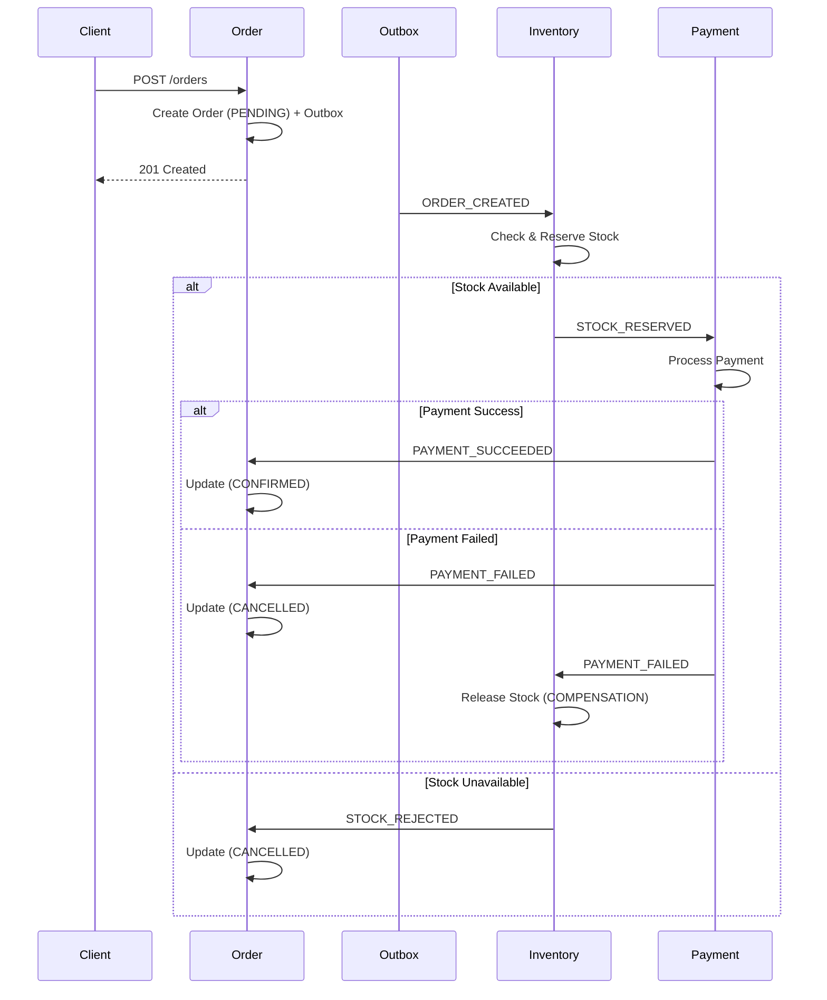

# 📅 TUẦN 3: Hoàn thành Luồng & Logic Hoàn tác (Compensation)

**Mục tiêu:** Thêm 2 service nữa (`Payment` & `Notification`) và triển khai logic "hoàn tác" (Compensation) đầy đủ để xử lý các trường hợp thất bại trong Saga flow.

---

## 📋 Danh sách Tasks

| # | Tên Task | Mô tả tóm tắt | Priority | Estimated Time |
|---|----------|---------------|----------|----------------|
| 1 | **Tạo Payment Service** | Tạo service mới `services/payment` với cấu trúc Clean Architecture chuẩn. Service này không cần DB (stateless). Setup Dockerfile, thêm vào docker-compose.yml. | 🔴 High | 2-3 giờ |
| 2 | **Implement Payment Service - Consumer STOCK_RESERVED** | Implement consumer nhận event `STOCK_RESERVED` từ RabbitMQ. Mock logic thanh toán với `Math.random()` để simulate success (>0.1) và failure (<0.1). Publish `PAYMENT_SUCCEEDED` hoặc `PAYMENT_FAILED`. | 🔴 High | 2-3 giờ |
| 3 | **Update Order Service - Consumer PAYMENT_SUCCEEDED** | Implement consumer nhận event `PAYMENT_SUCCEEDED`. Update Order status từ PENDING → CONFIRMED. Sử dụng finite-state-machine library để manage transitions. | 🔴 High | 2 giờ |
| 4 | **Update Order Service - Consumer PAYMENT_FAILED** | Implement consumer nhận event `PAYMENT_FAILED`. Update Order status từ PENDING → CANCELLED với cancellationReason. Log với correlationId. | 🔴 High | 1-2 giờ |
| 5 | **Implement Compensation Logic - Inventory Release** | **CRITICAL:** Inventory Service consume event `PAYMENT_FAILED`. Logic: Tìm reservation dựa trên orderId → release stock (cộng ngược số lượng đã trừ). Sử dụng idempotency để tránh release 2 lần. | 🔴 Critical | 3-4 giờ |
| 6 | **Implement State Machine cho Order** | Refactor Order model để sử dụng finite-state-machine library (ví dụ: `javascript-state-machine`). Define transitions: PENDING → CONFIRMED, PENDING → CANCELLED. Validate state transitions. | 🟡 Medium | 2-3 giờ |
| 7 | **Handle Extended Compensation** | Mở rộng compensation logic: Handle các edge cases như timeout, partial failures. Implement compensation handlers với proper error handling. | 🔴 High | 3-4 giờ |
| 8 | **Update API Gateway Routes** | Đảm bảo routing cho Payment Service (nếu cần health check endpoint). Update configuration. | 🟢 Low | 30 phút |
| 9 | **Integration Testing - Happy Path** | Test end-to-end happy path: POST /orders → PENDING → STOCK_RESERVED → PAYMENT_SUCCEEDED → CONFIRMED. | 🔴 High | 2-3 giờ |
| 10 | **Integration Testing - Compensation Path** | Test compensation flow: POST /orders → PENDING → STOCK_RESERVED → PAYMENT_FAILED → Inventory release → Order CANCELLED. Verify stock restored correctly. | 🔴 High | 2-3 giờ |
| 11 | **Test Idempotency của Compensation** | Test duplicate compensation: Publish PAYMENT_FAILED 2 lần → verify stock chỉ release 1 lần. Check logs cho idempotency skip message. | 🟡 Medium | 1 giờ |
| 12 | **Update Documentation** | Update System Requirements Specification với Payment service. Update MESSAGE_BROKER_ARCHITECTURE với compensation flows. Vẽ Mermaid diagram cho full Saga flow. | 🟢 Low | 1-2 giờ |

---

## 🎯 Kiến trúc Saga Flow hoàn chỉnh

### ✅ **Happy Path (Thành công):**
```
Client → POST /orders
       ↓
Order Service → Create Order (PENDING) + Outbox
       ↓
Outbox Processor → Publish ORDER_CREATED
       ↓
Inventory Service → Check stock → Reserve → Publish STOCK_RESERVED
       ↓
Payment Service → Process payment → Publish PAYMENT_SUCCEEDED
       ↓
Order Service → Update Order (CONFIRMED)
```

### ❌ **Compensation Path (Payment Failed):**
```
... (same as above until Payment Service)
       ↓
Payment Service → Payment fails → Publish PAYMENT_FAILED
       ↓
Order Service → Update Order (CANCELLED)
       ↓
Inventory Service → Release reserved stock (COMPENSATION)
```

### ⚠️ **Extended Compensation (Partial Failure):**
```
... (Payment succeeds but business validation fails)
       ↓
Order Service → Detect validation failure
       ↓
Order Service → Publish COMPENSATE_PAYMENT
       ↓
Payment Service → Refund transaction
       ↓
Inventory Service → Release stock
       ↓
Order Service → Update Order (CANCELLED)
```

---

## ✅ Acceptance Criteria (AC)

### **Functional Requirements:**
- [ ] Payment Service nhận `STOCK_RESERVED`, xử lý payment (mock), publish kết quả
- [ ] Order Service nhận `PAYMENT_SUCCEEDED` → status CONFIRMED
- [ ] Order Service nhận `PAYMENT_FAILED` → status CANCELLED
- [ ] Inventory Service nhận `PAYMENT_FAILED` → release stock đã reserve
- [ ] State machine validate transitions (không thể CONFIRMED → PENDING)
- [ ] Order Service logs status changes với proper tracing

### **Compensation Requirements:**
- [ ] **Test Happy Path:** Full flow từ POST order → CONFIRMED thành công
- [ ] **Test Compensation:** Cố tình làm Payment fail → Order CANCELLED + Stock released
- [ ] **Test Idempotency:** Publish PAYMENT_FAILED 2 lần → Stock chỉ release 1 lần
- [ ] **Verify Stock Consistency:** Check DB Inventory trước/sau compensation, số lượng khớp
- [ ] **Test Extended Compensation:** Notification fail → Trigger full rollback chain

### **Observability Requirements:**
- [ ] Logs của Inventory compensation rõ ràng: "Released stock for orderId=xxx, productId=yyy, quantity=2"
- [ ] Jaeger trace hiển thị full compensation flow với spans
- [ ] Logs chứa `correlationId` xuyên suốt cả compensation path
- [ ] Metrics: `saga_compensation_total`, `saga_compensation_duration_seconds`

### **Code Quality:**
- [ ] Payment Service follow Clean Architecture
- [ ] State machine được unit test với tất cả transitions
- [ ] Compensation handlers có error handling đầy đủ
- [ ] Unit tests coverage >70% cho Payment, Notification services

---

## 📊 Estimated Total Time

**Total:** 18-24 giờ (~2-3 ngày làm việc)

**Breakdown:**
- Core Implementation: 9-13 giờ (Tasks 1-5)
- Advanced Logic (State Machine, Compensation): 5-7 giờ (Tasks 6-7)
- Testing & Validation: 5-6 giờ (Tasks 9-11)
- Infrastructure & Docs: 1-2 giờ (Tasks 8, 12)

---

## 🔗 Dependencies

**Infrastructure:**
- MongoDB Replica Set (đã có từ Tuần 2)
- RabbitMQ với Topic Exchange (đã có từ Tuần 2)
- Redis cho idempotency (đã có từ Tuần 2)
- Jaeger cho tracing (đã có từ Tuần 1)

**Packages:**
- `javascript-state-machine` hoặc `xstate` - State machine cho Order
- `@opentelemetry/api` - Tracing (đã có)
- `uuid` - Generate eventId (đã có)

**Prerequisites:**
- Tuần 2 hoàn thành: Order → Inventory flow với Outbox Pattern
- @ecommerce/message-broker có idempotency và schema validation
- Inventory Service có logic reserve stock

---

## 📝 Notes & Best Practices

1. **Compensation Logic** phải được thiết kế idempotent - release stock nhiều lần không làm tăng vô hạn
2. **State Machine** giúp tránh race conditions và invalid state transitions
3. **Timeout Strategy:** Nếu Payment Service không respond sau X giây, trigger auto-compensation
4. **Partial Compensation:** Chỉ rollback những bước đã thành công (forward recovery)
5. **Audit Trail:** Log tất cả compensation events để forensics sau này

---

## 🚨 Critical Warnings

- ⚠️ **Compensation PHẢI idempotent** - tránh double-release stock gây inconsistency
- ⚠️ **State Machine transitions phải atomic** - sử dụng Mongo transactions
- ⚠️ **KHÔNG dùng distributed transactions (2PC)** - chỉ dùng Saga pattern
- ⚠️ **Timeout handling** - Payment Service cần có timeout, không được block vô hạn
- ⚠️ **Dead Letter Queue** - Compensation messages fail phải vào DLQ để manual recovery

---

## 🔍 Testing Scenarios

### **Scenario 1: Happy Path (80% cases)**
```bash
# Expected: Order CONFIRMED, stock giảm, email sent
POST /orders { productIds: [id1], quantities: [2] }
→ Poll GET /orders/:id until status=CONFIRMED (timeout 30s)
→ Verify inventory.stock giảm 2
```

### **Scenario 2: Payment Failed (15% cases)**
```bash
# Trigger: Math.random() < 0.1 in Payment Service
# Expected: Order CANCELLED, stock restored, cancellation email
POST /orders { productIds: [id1], quantities: [2] }
→ Poll until status=CANCELLED
→ Verify inventory.stock không đổi (đã được release)
```

### **Scenario 3: Duplicate Compensation**
```bash
# Manually publish PAYMENT_FAILED twice with same eventId
# Expected: Stock chỉ release 1 lần, log "Skipping duplicate event"
broker.publish('payment.order.failed', { orderId, eventId: 'test-123' })
broker.publish('payment.order.failed', { orderId, eventId: 'test-123' })
→ Check logs, verify idempotency skip
```

### **Scenario 4: Extended Compensation (5% cases)**
```bash
# Simulate: Notification service throws error
# Expected: Full rollback (Payment refund, Stock release, Order CANCELLED)
# (This is advanced - optional for Week 3)
```

---

## 📚 Routing Keys Convention

Áp dụng pattern `{service}.{entity}.{action}` từ Tuần 2:

| Event | Routing Key | Publisher | Consumers |
|-------|-------------|-----------|-----------|
| Order Created | `order.order.created` | Order Service | Inventory |
| Stock Reserved | `inventory.order.reserved` | Inventory | Payment |
| Stock Rejected | `inventory.order.reserve_failed` | Inventory | Order |
| Payment Succeeded | `payment.order.succeeded` | Payment | Order |
| Payment Failed | `payment.order.failed` | Payment | Order, Inventory |
| Compensate Payment | `saga.payment.compensate` | Order Service | Payment |

**Queue Bindings:**
- `payment.events` queue binds to: `inventory.order.reserved`, `inventory.order.reserve_failed`
- `inventory.events` queue binds to: `order.#`, `payment.order.failed`

---

## 🎨 Mermaid Diagram (Full Saga)



---

## 📖 References

- [Saga Pattern](https://microservices.io/patterns/data/saga.html)
- [Compensating Transactions](https://docs.microsoft.com/en-us/azure/architecture/patterns/compensating-transaction)
- [Finite State Machines in Node.js](https://github.com/jakesgordon/javascript-state-machine)
- [Idempotency in Distributed Systems](https://aws.amazon.com/builders-library/making-retries-safe-with-idempotent-APIs/)

---

## ✅ Definition of Done

Tuần 3 được coi là hoàn thành khi:

1. ✅ 3 services (Order, Inventory, Payment) hoạt động trong 1 Saga flow
2. ✅ Happy path test pass: Order → CONFIRMED trong <5s
3. ✅ Compensation test pass: Payment fail → Stock released → Order CANCELLED
4. ✅ Idempotency test pass: Duplicate PAYMENT_FAILED → Single compensation
5. ✅ Jaeger trace hiển thị đầy đủ spans cho cả happy path và compensation
6. ✅ Logs rõ ràng với correlationId xuyên suốt
7. ✅ Documentation updated với Saga flow diagram
8. ✅ Không có race conditions hoặc inconsistent states trong DB

**Deliverables:**
- [ ] 1 new service: `services/payment`
- [ ] Updated `services/order` với state machine
- [ ] Updated `services/inventory` với compensation logic
- [ ] 3 E2E test scripts: happy path, compensation, idempotency
- [ ] Updated `docs/SAGA_FLOW_COMPLETE.md` với full sequence diagram
- [ ] Metrics dashboard cho compensation tracking
