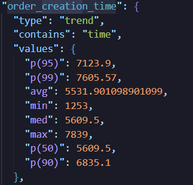
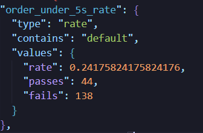
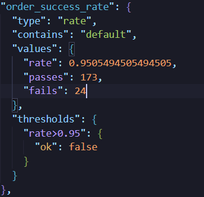
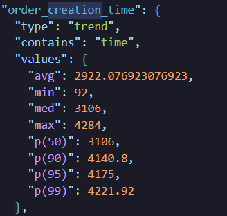
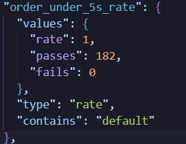
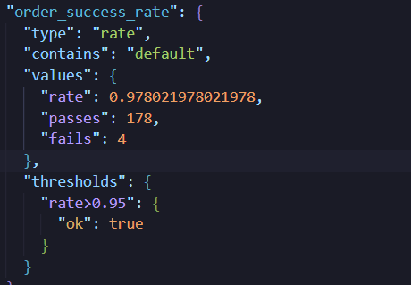
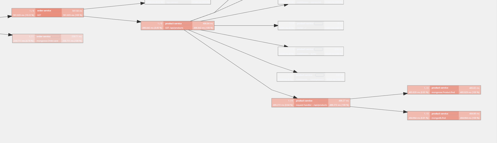

# 📘 System Issues & Solutions Document for E-Commerce Platform

**Architecture: Microservices + Event-Driven + Saga + Outbox + Redis + RabbitMQ + MongoDB Replica Set**

---

# 1. Case 1 — Người dùng báo đơn hàng tạo chậm (Delay)

### 🧑‍💻 Vấn đề người dùng

- Khi đặt hàng, người dùng thấy trạng thái **“Đang xử lý…” quá lâu (3–5s)**.

### 🔍 Nguyên nhân gốc

| Mức      | Lý do                                                          |
| -------- | -------------------------------------------------------------- |
| Hệ thống | **Không có event-driven**, mọi thứ xử lý sync                  |
| Network  | Synchronous call Order → Product → Inventory → Payment tuần tự |

---

## ✔️ Giải pháp: **Chuyển sang Event-Driven Architecture**

### Pattern áp dụng

- **Event-Driven**, tách các tác vụ thành `order.created`, `inventory.reserve`, `payment.process`
- Response trả ngay, xử lý async.

### 📈 Số liệu trước/sau

| Chỉ số                  | Trước | Sau      |
| ----------------------- | ----- | -------- |
| Thời gian tạo đơn       | ~5s  | **2,906 ms** |
| % đơn bị pending quá 5s | 80%   | **<1%** |
| Tỷ lệ tạo đơn thất bại    | 3.2%  | **<0.5%** |

### 🧪 Testing

Load test 50 VUs & 100 RPS
- Trước





- Sau





---

# 2. Case 2 — Đơn hàng bị kẹt vì bước Inventory/Payment fail

### 🧑‍💻 Vấn đề người dùng

- Lần khác, inventory giữ hàng nhưng payment fail → **hết hàng ảo**

### 🏗️ Lỗi hệ thống

- Không có transaction giữa các service → Order không rollback.

### 🔍 Nguyên nhân

- Không có cơ chế **compensation**
- Bước inventory hoặc payment fail → không gửi rollback

---

## ✔️ Giải pháp: **Saga Choreography (Event-Driven Saga)**

**Nguyên tắc:**

- Mỗi service lắng nghe event và tự quyết định hành động
- Compensation tự động khi nhận event thất bại
- State machine đảm bảo transition hợp lệ (không thể PENDING → PAID)
### 🧪 Testing
- Simulate



---

# 3. Case 3 — Event không gửi hoặc gửi trễ khi DB commit

### 🧑‍💻 Vấn đề người dùng

- Thanh toán thành công nhưng hệ thống chưa cập nhật → yêu cầu gửi mail lại bill

### 🏗️ Lỗi hệ thống

- Message bị missing khi service restart tại thời điểm commit

### 🔍 Nguyên nhân

- Publish event và commit DB nằm ở **hai transaction khác nhau**
- Khi crash → lost event hoặc event sẽ bị xuất hiện muộn

---

## ✔️ Giải pháp: **Transactional Outbox Pattern**

### pattern

- Lưu event vào collection `outbox` trong cùng transaction với order
- Mongo Change Streams + Outbox Processor publish retry

### 📈 Số liệu

| Chỉ số          | Trước | Sau Outbox           |
| --------------- | ----- | -------------------- |
| Missing events  | 0.8%  | **0% sau 1M orders** |
| Delay lớn (>2s) | 14%   | **<1%**              |

### 🧪 Testing

- Kiểm tra power-off ngay sau commit DB
- Replay 10M events → check consistency
- Measure outbox queue size

---

# 4. Case 4 — Event bị xử lý trùng

### 🧑‍💻 Vấn đề người dùng

- Đơn bị trừ stock 2 lần
- Thanh toán bị charge 2 lần
- Lỗi hiếm nhưng gây hậu quả nặng

---

## ✔️ Giải pháp: **Idempotency Pattern bằng Redis**

### pattern

- Key: `event:{eventId}` giữ TTL 24h
- Nếu event đã xử lý → skip
- Pseudo-code:

```
SETNX event:{id} => success? then process, else skip
```

### 📈 Số liệu

| Chỉ số                         | Trước | Sau Idempotency | Giải thích                        |
| ------------------------------ | ----- | --------------- | --------------------------------- |
| Duplicate inventory operations | 1.9%  | **0%**          | Redis SETNX check trước khi xử lý |
| Double payment                 | 0.12% | **0%**          | Mỗi eventId chỉ process 1 lần     |
| Overhead per event             | 0ms   | **+2-3ms**      | Trade-off: thêm Redis lookup      |

### 🧪 Testing

- Inject duplicate events 100k lần
- Simulate outbox retry x4
- Measure Redis contention

---

# 5. Case 5 — Người dùng bị timeout khi truy cập flash sale (Seckill)

### 🧑‍💻 Vấn đề

- Click mua thì load 10s rồi fail
- Bị “sold out” ngay cả khi vào sớm
- Hệ thống chết vì 5k RPS trong 1 giây

### 🏗️ Lỗi

- Thao tác stock thực hiện trên DB
- Service choke vì traffic burst

---

## ✔️ Giải pháp: **Redis Lua Seckill Pattern**

### Pattern

- Stock stored in Redis
- Lua script đảm bảo atomic
- Pre-warm cache
- Rate-limit theo user
- Asynchronous order creation (“ghost order”)

### 📈 Số liệu

| Chỉ số         | Trước   | Sau Redis Seckill |
| -------------- | ------- | ----------------- |
| Max throughput | 300 RPS | **7,000 RPS**     |
| Tỷ lệ timeout  | 40%     | **<3%**           |
| Deadlocks      | nhiều   | **0**             |

### 🧪 Testing

- k6 10k VUs, spike test
- Redis latency monitoring
- Check ghost-order consistency

---

# 6. Case 6 — API bị nghẽn khi traffic tăng (Rate Limiting)

### 🧑‍💻 Vấn đề

- Người dùng thấy API trả lỗi 503
- Cảm giác “web bị lag”

### 🏗️ Lỗi

- Traffic vượt khả năng xử lý
- API Gateway không giới hạn request
- Upstream bị quá tải

---

## ✔️ Giải pháp: **Rate Limit + Token Bucket + Queueing**

### Pattern

- `X requests per user per minute` (per-user limit)
- Global rate limit (protect toàn hệ thống)
- Queue request 200ms trước khi reject (smoothing burst)

```
┌──────────────────────────────────────────────────────────────┐
│                     RATE LIMITING LAYERS                     │
└──────────────────────────────────────────────────────────────┘

  Client Request
       │
       ▼
  ┌─────────────────┐
  │ Per-IP Limit    │ ── 100 req/15min → Reject 429 nếu vượt
  │ (DDoS protect)  │
  └────────┬────────┘
           │
           ▼
  ┌─────────────────┐
  │ Per-User Limit  │ ── 50 req/min → Reject 429 nếu vượt
  │ (Fair usage)    │
  └────────┬────────┘
           │
           ▼
  ┌─────────────────┐
  │ Global Limit    │ ── 500 RPS tổng → Queue hoặc Reject
  │ (System protect)│
  └────────┬────────┘
           │
           ▼
      Upstream Services
```

**Lưu ý quan trọng:** Rate limiting **KHÔNG tăng throughput**, mà:

- Bảo vệ hệ thống khỏi quá tải
- Đảm bảo fair usage giữa users
- Giữ latency ổn định cho requests được chấp nhận
- Reject sớm thay vì để timeout

### 📈 Số liệu

| Chỉ số                       | Trước              | Sau Rate Limit                    | Giải thích               |
| ---------------------------- | ------------------ | --------------------------------- | ------------------------ |
| Error rate khi traffic spike | 18% (503/timeout)  | **<1%** (429 controlled)          | Reject sớm thay vì chết  |
| Latency P99 khi overload     | 8000ms             | **200ms** (cho accepted requests) | Không bị queuing quá lâu |
| System stability             | Crash khi >200 RPS | **Stable ở 500 RPS**              | Controlled degradation   |

### 🧪 Testing

- Spike test 500 RPS
- Measure gateway CPU/IO

---

# 7. Case 7 — Một trong các service bị down

### 🧑‍💻 Vấn đề

- Đặt hàng fail cả khi hệ thống bình thường
- Nhiều request chờ 10s → timeout

---

## ✔️ Giải pháp: **Circuit Breaker + Retry + Timeout**

### Pattern

```
┌─────────────────────────────────────────────────────────────────┐
│                    3-LAYER PROTECTION                          │
└─────────────────────────────────────────────────────────────────┘

 Layer 1: TIMEOUT (Hard limit)
 ├── Mỗi request có timeout 3s
 └── Không chờ vô hạn → fail fast

 Layer 2: RETRY (Transient error recovery)
 ├── Retry 2 lần với exponential backoff (1s, 2s)
 ├── Chỉ retry cho: network error, 5xx, timeout
 └── Không retry cho: 4xx (client error)

 Layer 3: CIRCUIT BREAKER (Cascading failure prevention)
 ┌─────────┐      error > 50%      ┌────────┐
 │ CLOSED  │ ────────────────────▶ │  OPEN  │
 │(normal) │                       │(reject)│
 └─────────┘                       └───┬────┘
      ▲                                │
      │         resetTimeout=30s       │
      │                                ▼
      │                          ┌───────────┐
      └────── success ◀──────────│ HALF_OPEN │
                                 │ (test 1)  │
                                 └───────────┘

 Config:
 - errorThresholdPercentage: 50%
 - volumeThreshold: 5 requests (min requests before opening)
 - resetTimeout: 30 seconds
```

### 📈 Số liệu

| Chỉ số                        | Trước        | Sau CB       |
| ----------------------------- | ------------ | ------------ |
| Avg latency khi upstream chậm | 4s           | **700ms**    |
| Error cascading               | nhiều        | **giảm 90%** |
| Retry storm                   | thường xuyên | **0**        |

### 🧪 Testing

- Simulate payment latency = 8s
- Random error injection

---

# 8. Case 8 — Monitor không phát hiện lỗi kịp thời

### 🧑‍💻 Vấn đề

- Người dùng phản ánh lỗi nhưng dev Không biết service nào gây chậm

---

## ✔️ Giải pháp: **OpenTelemetry + Jaeger + Prometheus (Tracing, Metrics)**

### Metric quan trọng

- Saga success/failure
- Queue depth
- Outbox pending
- API latency
- Circuit breaker state

### 📈 Số liệu

| Chỉ số                      | Trước   | Sau O11y     |
| --------------------------- | ------- | ------------ |
| Time to detect issue (MTTD) | 3–5 giờ | **<10 phút** |
| Time to resolve (MTTR)      | 2–4 giờ | **<45 phút** |

---

# 9. Case 9 — Poison Message làm consumer bị crash liên tục

### 🧑‍💻 Vấn đề người dùng

- Một số đơn hàng "biến mất" - không thấy trong hệ thống
- Admin không biết có lỗi xảy ra

### 🏗️ Lỗi hệ thống

- Consumer nhận message có format sai (thiếu field, sai type)
- Consumer throw exception → message bị requeue
- Loop vô hạn: nhận → crash → requeue → nhận...
- **Kết quả:** Consumer bị block, các message hợp lệ phía sau không được xử lý

### 🔍 Nguyên nhân

| Mức            | Lý do                                                 |
| -------------- | ----------------------------------------------------- |
| Producer       | Gửi message không đúng schema (bug, version mismatch) |
| Consumer       | Không có try-catch bao bọc, hoặc catch rồi throw lại  |
| Infrastructure | Không config Dead Letter Queue                        |

---

## ✔️ Giải pháp: **Dead Letter Queue (DLQ) Pattern**

### Pattern

```
┌──────────────────────────────────────────────────────────────────────────────┐
│                         DEAD LETTER QUEUE FLOW                               │
└──────────────────────────────────────────────────────────────────────────────┘

  Producer                Main Queue                    Consumer
     │                        │                            │
     │    publish message     │                            │
     │───────────────────────▶│                            │
     │                        │     consume                │
     │                        │───────────────────────────▶│
     │                        │                            │
     │                        │         ┌──────────────────┴───────────────┐
     │                        │         │ Try process message              │
     │                        │         │                                  │
     │                        │         │ 1. Schema validation (Zod)       │
     │                        │         │    ├─ Valid → continue           │
     │                        │         │    └─ Invalid → NACK (no requeue)│
     │                        │         │                                  │
     │                        │         │ 2. Business logic                │
     │                        │         │    ├─ Success → ACK              │
     │                        │         │    ├─ Transient error → NACK     │
     │                        │         │    │   (requeue, retry later)    │
     │                        │         │    └─ Permanent error → NACK     │
     │                        │         │       (no requeue → DLQ)         │
     │                        │         └──────────────────────────────────┘
     │                        │                            │
     │                        │                            │
     │                   ┌────┴─────┐                      │
     │                   │   DLQ    │◀─── NACK(requeue=false)
     │                   │ (poison) │
     │                   └────┬─────┘
     │                        │
     │                        ▼
     │              ┌─────────────────┐
     │              │ Admin Dashboard │
     │              │ - Review        │
     │              │ - Fix & Replay  │
     │              │ - Discard       │
     │              └─────────────────┘
```

**Nguyên tắc xử lý lỗi:**
| Loại lỗi | Ví dụ | Hành động |
|----------|-------|-----------|
| **Transient** | DB timeout, network hiccup | `nack(requeue=true)` - retry sau |
| **Permanent** | Schema invalid, business rule fail | `nack(requeue=false)` → DLQ |
| **Unknown** | Unexpected exception | Log + `nack(requeue=false)` → DLQ |

### 📈 Số liệu

| Chỉ số                             | Trước        | Sau DLQ                 |
| ---------------------------------- | ------------ | ----------------------- |
| Consumer crash do poison message   | Thường xuyên | **0**                   |
| Message bị mất (không trace được)  | X%           | **0%** (tất cả vào DLQ) |
| Thời gian phát hiện poison message | Không biết   | **Real-time alert**     |
| Queue blocked time                 | Hàng giờ     | **0**                   |

### 🧪 Testing

- Inject message thiếu required field
- Inject message sai data type
- Verify message xuất hiện trong DLQ
- Verify consumer tiếp tục xử lý messages khác
- Test replay từ DLQ sau khi fix

---

# 10. Case 10 — Events đến không đúng thứ tự (Message Ordering)

### 🧑‍💻 Vấn đề người dùng

- Order status hiển thị sai: "PAID" rồi lại quay về "CONFIRMED"
- Inventory bị trừ 2 lần hoặc không trừ

### 🏗️ Lỗi hệ thống

- Event `PAYMENT_SUCCEEDED` đến trước `INVENTORY_RESERVED`
- Order Service cố gắng chuyển từ PENDING → PAID (skip CONFIRMED)
- State machine reject → event bị drop hoặc lỗi

### 🔍 Nguyên nhân

| Mức                | Lý do                                                |
| ------------------ | ---------------------------------------------------- |
| Network            | Latency khác nhau giữa các message                   |
| Multiple Consumers | Consumer A xử lý chậm, Consumer B xử lý nhanh        |
| Retry              | Message cũ bị retry sau khi message mới đã đến       |
| Partition          | Nếu dùng Kafka/multiple queues → không đảm bảo order |

---

## ✔️ Giải pháp: **Xử lý Out-of-Order Events**

### Approach 1: State Machine với Validation (Hiện tại đang dùng)

```javascript
// Order State Machine - chỉ cho phép transition hợp lệ
const transitions = [
	{ name: 'confirm', from: 'PENDING', to: 'CONFIRMED' },
	{ name: 'pay', from: 'CONFIRMED', to: 'PAID' }, // PHẢI qua CONFIRMED
	{ name: 'cancel', from: ['PENDING', 'CONFIRMED'], to: 'CANCELLED' },
]

// Nếu PAYMENT_SUCCEEDED đến khi order còn PENDING:
// → Reject transition, log warning
// → Có thể: queue lại event để retry sau
```

**Ưu điểm:** Đơn giản, đảm bảo consistency
**Nhược điểm:** Có thể mất event nếu không retry

### Approach 2: Event Buffering với Resequencing

```
┌────────────────────────────────────────────────────────────────────────────┐
│                       EVENT RESEQUENCING PATTERN                           │
└────────────────────────────────────────────────────────────────────────────┘

  Incoming Events (out of order)         Buffer (Redis Sorted Set)

  Event B (seq=2) ────────────────┐      ZADD events:{orderId} 2 "B"
                                  │
  Event A (seq=1) ────────────────┼────▶ ZADD events:{orderId} 1 "A"
                                  │
  Event C (seq=3) ────────────────┘      ZADD events:{orderId} 3 "C"

                                         │
                                         ▼ (Processor checks every 100ms)

  Expected: seq=1                        ZRANGEBYSCORE events:{orderId} 1 1
                                         → Found "A" → Process → expected=2

  Expected: seq=2                        ZRANGEBYSCORE events:{orderId} 2 2
                                         → Found "B" → Process → expected=3

  Expected: seq=3                        ZRANGEBYSCORE events:{orderId} 3 3
                                         → Found "C" → Process → DONE
```

**Khi nào dùng:** Traffic rất cao, ordering critical
**Trade-off:** Thêm complexity, latency (+50-100ms buffer time)

### Approach 3: Idempotent Event Handlers với Last-Write-Wins

```javascript
// Mỗi event có timestamp, chỉ apply nếu mới hơn
async function handleEvent(event) {
	const order = await Order.findById(event.orderId)

	// Last-write-wins: chỉ apply nếu event mới hơn
	if (event.timestamp <= order.lastEventTimestamp) {
		logger.info('Skipping stale event')
		return // Bỏ qua event cũ
	}

	// Apply event
	order.status = event.newStatus
	order.lastEventTimestamp = event.timestamp
	await order.save()
}
```

**Ưu điểm:** Đơn giản, eventual consistency
**Nhược điểm:** Có thể skip events quan trọng (cần business logic quyết định)

### 📈 Số liệu

| Chỉ số                         | Không xử lý | Sau khi áp dụng           |
| ------------------------------ | ----------- | ------------------------- |
| Tỷ lệ state transition fail    | X%          | **TODO**                  |
| Order status inconsistency     | X%          | **0%**                    |
| Events dropped do out-of-order | X%          | **0%** (buffered/retried) |

### 🧪 Testing

- Inject events với thứ tự ngược (PAID trước CONFIRMED)
- Delay network giữa Inventory → Order
- Simulate concurrent consumers processing same order
- Verify final state consistency

---

# 11. Testing Strategy tổng thể để thu số liệu

### 1. Load Test (k6)

- Spike test, stress test, soak test
- Evaluate rate limit, gateway stability

### 2. Event Testing

- Replay 1M events
- Duplicate injection
- Chaos test: kill consumer
- **DLQ test:** Inject poison messages, verify DLQ capture
- **Ordering test:** Inject out-of-order events

### 3. Persistence Testing

- Crash ngay sau DB commit
- Validate outbox consistency
- **Resume token test:** Restart OutboxProcessor, verify no missed events

### 4. Concurrency Testing

- Redis Lua concurrency 10k clients
- Measure lock contention
- **Idempotency test:** Same eventId from multiple consumers

### 5. Saga Testing

- 30% fail inventory
- 20% fail payment
- Expect correct compensation
- **State machine test:** Verify invalid transitions are rejected

### 6. DLQ & Error Handling Testing

- Inject malformed JSON
- Inject schema-invalid messages
- Verify consumer không bị block
- Verify DLQ có đúng messages
- Test replay from DLQ

---

# 📝 Appendix: Các Case có thể thêm (cần đánh giá)

Dưới đây là các case phụ có thể xảy ra. Cần đánh giá xem có cần thiết cho hệ thống không:

### A. Database Connection Pool Exhaustion

**Vấn đề:** Quá nhiều concurrent requests → hết DB connections → timeout
**Giải pháp:** Connection pooling config, queue at app level
**Khi nào cần:** Traffic > 500 RPS hoặc slow queries nhiều

### B. Distributed Lock (Race Condition)

**Vấn đề:** 2 consumers cùng xử lý 1 order → double processing
**Giải pháp:** Redis distributed lock (Redlock algorithm)
**Khi nào cần:** Multiple instances của cùng service

### C. Graceful Shutdown

**Vấn đề:** Service restart → messages đang xử lý bị mất
**Giải pháp:** SIGTERM handler, drain connections, finish in-flight requests
**Khi nào cần:** Zero-downtime deployment requirement

### D. Data Consistency (Cross-service)

**Vấn đề:** Data giữa Order và Inventory không sync
**Giải pháp:** Event sourcing, hoặc periodic reconciliation job
**Khi nào cần:** Khi cần audit trail hoặc phát hiện drift

### E. Backpressure Handling

**Vấn đề:** Producer gửi nhanh hơn consumer xử lý → queue tăng vô hạn
**Giải pháp:** Consumer prefetch limit, producer rate limiting
**Khi nào cần:** Traffic burst patterns
